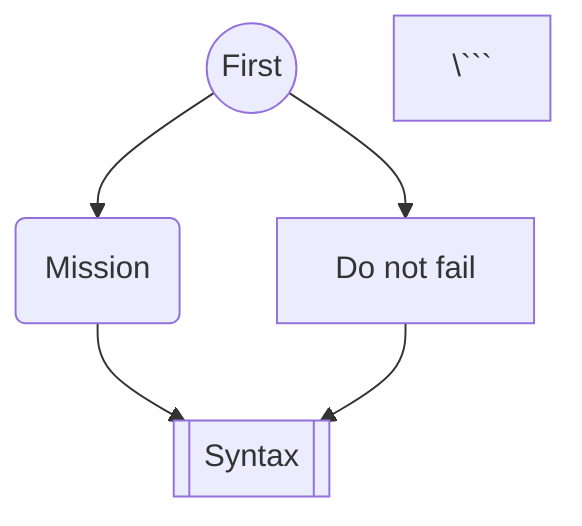

# Do_It

This website is built using [Docusaurus](https://docusaurus.io/), a modern static website generator.

## Requirements
- [Node.js](https://nodejs.org/en/)
- [npm](https://www.npmjs.com/)

## Installation
1. Clone the repository: `git clone https://github.com/boxboxjason/do_it.git`
2. Navigate to the project directory: `cd do_it`
3. Install the dependencies: `npm install`
4. Build the static website: `npm run build`
5. Serve the website at http://localhost:3000/do_it : `npm run serve`

## How to contribute
1. Create a new branch: `git checkout -b COURSE_NAME`
2. Make your changes in the corresponding course folder (e.g. `cours/gestion_modelisation/service_design`)
3. If you are adding a completely new course, add them to the sidebar in `sidebars.js`
4. Add your changes: `git add .`
5. Commit your changes: `git commit -m "Add new course COURSE_NAME"`
6. Push to the branch: `git push origin COURSE_NAME`
7. Submit a pull request

### Plugins
- [Docusaurus Markdown](https://docusaurus.io/docs/markdown-features): Markdown features supported by Docusaurus
- [Mermaid](https://mermaid-js.github.io/mermaid/#/): Markdown-like script language for generating charts from text
- [Katex](https://katex.org/): Math typesetting library for the web based on LaTeX
- [Prism](https://prismjs.com/): Syntax highlighting for code blocks

#### Mermaid
```markdown


#### Katex
```markdown
$$
GES = Scope 1 + Scope 2 + \frac{Scope 3}{\text{Durée de vie}}
$$
```

#### Prism
```markdown
```javascript
function hello() {
    console.log("Hello, world!");
}
\```
```

### Custom components
- [LinksSection](./src/components/LinksSection.js): Custom component to display a list of links that were used in the course

#### LinksSection
```markdown
import LinksSection from '@site/src/components/LinksSection';

# Main title

<LinksSection
    title="Resources"
    links={[
      {displayName: "Course Slides", url: "./documents/slides.pdf"},
      ]}
/>

## First Chapter
...
```
