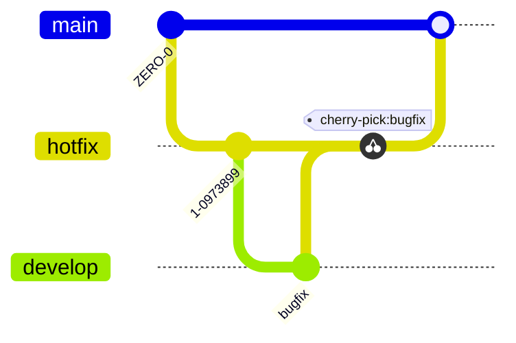

# Git



Git est un logiciel de gestion de versions décentralisé. C'est un logiciel libre créé par Linus Torvalds, le créateur de Linux. Il est utilisé pour le suivi des modifications apportées à un ensemble de fichiers. Il permet de travailler à plusieurs sur un même projet, de suivre l'évolution du code, de revenir en arrière, de gérer des branches, etc.

- **Gestion de versions**: Suivi des modifications apportées à un ensemble de fichiers
- **Décentralisé**: Chaque utilisateur possède une copie (locale) complète de l'historique des modifications

## Vocabulaire

### Code source
- **Repository (repo)**: Répertoire contenant les fichiers du projet et l'historique des modifications
- **Branch**: Branche de développement, permet de travailler sur une version du code sans impacter la version principale
- **Tag**: Marqueur sur un commit, il sert à identifier des points importants de l'historique
- **Fork**: Copie parallèle d'un repository
- **Clone**: Copie d'un repository

### Edition du code

#### Enregistrement des modifications
- **Commit**: Enregistrement d'une modification (en local)
- **Push**: Envoi des modifications locales vers le repository distant
- **Amend**: Modification (écrasement) du dernier commit (en local)
- **Stash**: Enregistrement temporaire de modifications non commitées (en local)

#### Gestion des branches
- **Pull request (Merge request)**: Demande de fusion de deux branches
- **Pull**: Récupération (locale) des modifications du repository (distant)
- **Merge**: Fusion de deux branches
- **Conflict**: Conflit entre deux modifications
- **Rebase**: Réécriture de l'historique

### Alias
- **Remote**: Repository distant
- **Origin**: Alias du repository distant
- **Upstream**: Repository original
- **HEAD**: Pointeur sur la dernière modification (commit) enrégistrée

##  Prise en main

### Installation
- **Linux**: Installation via le gestionnaire de paquets (exemple apt: `sudo apt install git`)
- **MacOS**: Installation via [Homebrew](https://brew.sh) (commande: `brew install git`)
- **Windows**: Installation via [Git for Windows](https://git-scm.com/download/win)

### Configuration
- **Liste des configurations**: `git config --list`
- **Identité** (OBLIGATOIRE): `git config --global user.name "John Doe"`
- **Email** (OBLIGATOIRE): `git config --global user.email "example@email.com"`
- **Éditeur de texte** (OPTIONNEL): `git config --global core.editor "vim"`
- **Couleur de l'interface** (OPTIONNEL): `git config --global color.ui auto`

### Utilisation
- **Initialisation d'un repository**: `git init`
- **Clonage d'un repository existant**: `git clone <url>`
- **Ajout de fichiers modifié**: `git add <fichier>`
- **Enregistrement des modifications**: `git commit -m "Message de commit"`
- **Envoi des modifications (sur le repository distant)**: `git push`
- **Récupération des modifications (sur le repository distant)**: `git pull`

### Exemple
```bash
# Initialisation d'un repository
cd /chemin/vers/mon/projet
git init

# Création d'une branche pour travailler
git checkout -b ma-branche

# ... Travail sur des fichiers

# Ajout des fichiers modifiés
git add fichier1 fichier2

# Enregistrement des modifications
git commit -m "Ajout de fichier1 et fichier2"

# Définition du repository distant
git remote add origin <url>

# Envoi des modifications
git push -u origin ma-branche
```
