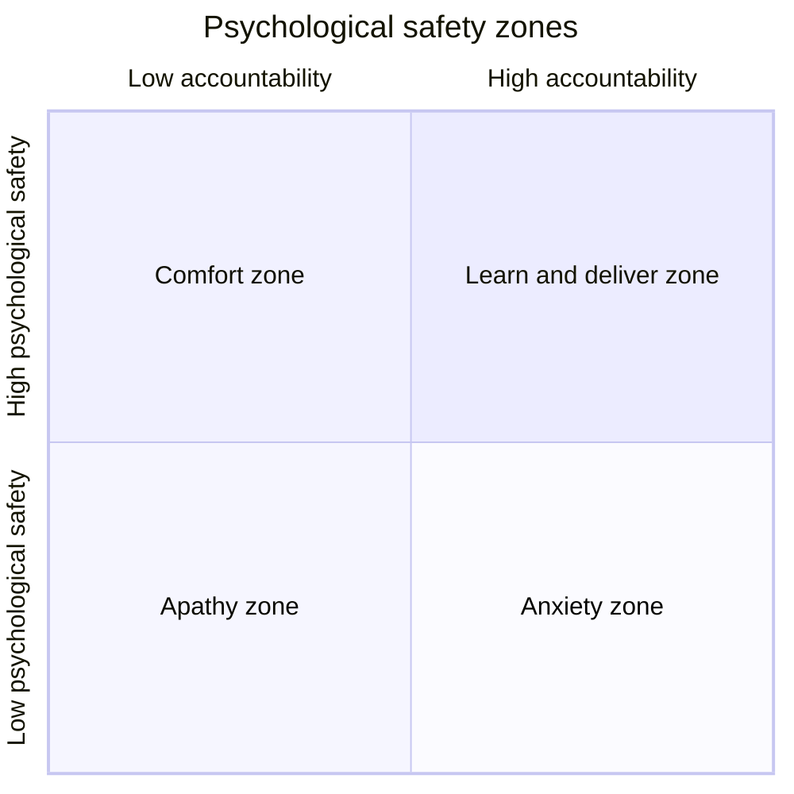

import LinksSection from '@site/src/components/LinksSection';

# High Performance Team

*Driving Business Results and Human values*

<LinksSection
    title="Ressources"
    links={[
      {displayName: "Slides Cours High Performance Team", url: "./documents/hpt.pdf"},

    ]}
/>

## Introduction
*You cannot mandate productivity.\
You must provide the tools (and environment) to let people become their best.* - Steve Jobs

Lors de nos interactions avec des personnes, des équipes, des proches, on **ne contrôle pas** les résultats. On ne peut pas forcer quelqu'un à être productif, à être créatif, à être innovant. On ne peut pas forcer quelqu'un à être heureux.

## Team Performance

### High Performance Team

#### Définition
Une équipe hautement performante est un group de personnes qui travaillent en synergie au travers de différents rôles. Ils travaillent ensemble avec vers un objectif commun. Ils délivrent de manière consistantes des résultats exceptionnels.

#### Pourquoi ?
Une équipe hautement performante est capable de délivrer des **résultats 5 fois supérieurs** à la moyenne. C'est une équipe qui **décuple les performances individuelles** en les faisant collaborer en **synergie**. Elle **attire** et **retient** les meilleurs talents. Elle crée une grande satisfaction des membres de l'équipe, un bien-être et un amusement.

## Les 5 dysfonctionnements d'une équipe
|||
|---|---|
|**Insouciance du résultat**|La poursuite des objectifs individuels et personnels diminue le succès de l'équipe|
|**Manque de responsabilité**|Le besoin d'éviter l'inconfort personnel empêche l'équipe de tenir les autres membres responsables|
|**Manque d'engagement**|Le manque de clarté ou d'engagement bloque les prises de décisions engageantes de l'équipe|
|**Peur du conflit**|Le désir de préserver l'harmonie artificielle empêche  l'équipe de s'engager dans des débats productifs|
|**Absence de confiance**|La peur de montrer sa faiblesse, de se montrer vulnérable empêche de créer un climat de confiance|

### Confiance
|Absence de confiance|Confiance|
|---|---|
|**Dissimulation** des faiblesses et des erreurs entre collègues|**Admettre** ses faiblesses et erreurs|
|**Peur** de demander de l'aide ou de donner des feedbacks|**Demande** de l'aide|
|**Pas d'engagement** au delà de ses responsabilités|**Concentration** du temps et de l'énergie sur les problèmes importants, pas la politique|
|**Mauvais jugement / Conclusions hâtives** sur les intentions / capacités des autres|**Bénéfice du doute** avant de tirer des conclusions|
|**Ressentiment** et **rancune**|**Heureux** de travailler en groupe|

La confiance se construit difficilement, mais se perd très rapidement. Elle est la base de toute relation humaine.\
Elle peut être renforcée par des **actions** et des **comportements**.
- **Partager** ses faiblesses, ses erreurs, ses manques de connaissances afin de se montrer **vulnérable** et de montrer qu'on a besoin des autres.
- **Respect** des membres de l'équipe, de leur temps, de leur travail, de leur opinion.
- **Intégrité** entre ses actions et ses paroles.
- **Etat d'esprit** positif et centré sur l'équipe.
- **Sécurité psychologique** pour que les membres de l'équipe se sentent en sécurité pour exprimer leurs idées, leurs opinions, leurs émotions.

#### Sécurité Psychologique

### Conflit
|Peur du conflit|Conflit|
|---|---|
|Réunions ennuyeuses, sans plus-value|Réunions énergiques, intéressantes|
|Environnements d'attaques à revers politiques / personnels|Minimisation de la politique|
|Evite les sujets controversiaux critique au succès de l'équipe|Discute des sujets critiques|
|Pas d'exploitation des opinions et des idées de l'équipe|Récolter et utiliser les opinions et les idées de l'équipe|
||Résout les problèmes rapidement|

#### Conflit Productif
Un *conflit productif* est un conflit qui se déroule sous la forme d'une **conversation structuré**. Il faut s'assurer qu'il y a bien un **dialogue**, de l'**écoute active**, de la **négotiation**. Cela permet d'établir une **conversation productive**.\
Il en découle de **meilleures solutions** et une **confiance renforcée**.

## Modèles

### Modèles de leadership

#### Contrôle unilatéral
Dans un modèle de leadership par le contrôle unilatéral, le **leader prend toutes les décisions**, contrôle les actions des membres de l'équipe, et ne laisse pas de place à l'initiative des membres de l'équipe.\
Il se base sur la croyance qu'**il est rationnel**, que **les autres ne le sont pas**(autant que lui) et qu'ils sont **motivés par la peur**.

Il applique des stratégies et des objectifs qu'il décide **unilatéralement**. Son but est de dominer les autres, que ce soit en manipulant l'information ou en applicant la stratégie du bâton et de la carotte. Il ne montre aucune émotion ni vulnérabilité.

#### Apprentissage mutuel
Dans un modèle de leadership par apprentissage mutuel, le leader consulte les membres pour constituer une **vision commune**.\
Il est **conscient de ses limites** et il **compte sur les autres** pour les compenser. Tout le monde est motivé par le fait d'apprendre et de contribuer.

Les objectifs et les stratégies sont définis **ensemble**. Le but est de faire **gagner toute l'équipe**. Il y a une bonne **transparence des informations**. Il crée un **sentiment d'engagement et de responsabilité**. Il montre ses émotions.

### Modèle de Mentalité
*Certainty is lethal to two of our most redeeming and humane qualities, imagination and empathy* - Being Wrong: Adventures in the Margin of Error by Kathryn Schulz

#### Je-Sais-Tout
Le **Je-Sais-Tout** est une personne qui a une **mentalité fixe**. Elle pense que ses capacités et ses talents sont **innés** et **immuables**. Elle pense qu'elle est **meilleure** que les autres. Elle a **peur de l'échec** et de montrer ses faiblesses.\
Elle **évite** les challenges, les critiques, les feedbacks. Elle **dévalorise** les autres.

Pour motiver cette personne, il faut faire preuve de patience et de persévérance. Il faut lui montrer qu'il est écouté. C'est son besoin le plus important. Ensuite on peut entrer dans le conflit productif.

#### Apprenant
L'**Apprenant** est une personne qui a une **mentalité de croissance**. Elle pense que ses capacités et ses talents sont **développables**. Elle pense qu'elle peut **apprendre** et **grandir**. Elle est **curieuse** et **ouverte**. Elle **accepte** l'échec et les critiques.
