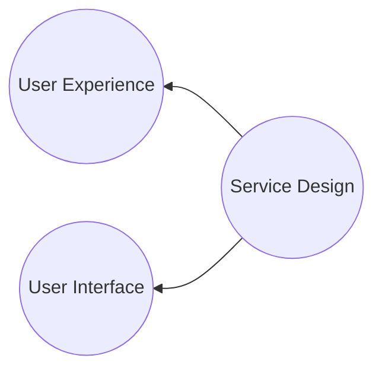

# Service Design

## Composantes d'un projet de transformation

Le design thinking est une démarche théorisée en 1980 par Rolf Faste, professeur à l'université de Stanford. Il s'agit d'une méthode de résolution de problèmes qui met l'utilisateur au centre de la réflexion. Le design thinking est une approche itérative qui permet de concevoir des produits ou des services en se mettant à la place de l'utilisateur final.

## Les enjeux digitaux "internes" d'une entreprise
Être au service du collaborateur pour une entreprise plus performante

- Recentrer le collaborateur sur les activités à valeur ajoutée promise lors de l'embauche, diminuer le sentiment de perte de temps.
- Diminuer les irritants du quotidien des collaborateurs et diminuer la fatigue nerveuse
- Avoir des collaborateurs heureux au travail favorise la performance de l'entreprise
-

**User Interface**: On conçoit l'interface entre un utilisateur et un dispositif (Interface Homme Machine). Elle erépond à des critères d'utilisabilité et d'usabilité
**User Experience**: On prend en compte l'émotion de l'utilisateur face au dispositif. On ajoute un critère de désirabilité
**Service Design**: On orchestre un ensemble de dispositifs en fonction des contrainttes d'usage. On ajoute du storytelling et de la cohérence

#### Considération idéale

Le design thinking est une philosophie qui permet d'apporter des solutions adaptées en se focalisant sur l'utilisateur final. Il s'agit d'une approche centrée sur l'humain qui permet de concevoir des produits ou des services en se mettant à la place de l'utilisateur. Le design thinking est une méthode itérative qui permet de résoudre des problèmes complexes en se concentrant sur les besoins des utilisateurs.

## Démcharche double diamant

Le double diamant est une méthode de design thinking qui permet de structurer la réflexion autour de 4 étapes clés:
1. **Connaissance utilisateurs, Analyse exploratoire**:
  - Utilisation de la matière disponible pour pré cadrer
  - Entretien et immersions terrain. Lancement auprès des sponsors
2. **Parcours et points de difficulté**
  - Synthèse de l'analyse grâce aux
    - Personas
    - Parcours utilisateurs
  - Ateliers de validation des parcours
3. **Idéation, définition des fonctionnalités**
  - Ateliers d'idéation (brainstorming,...) grâce au creative thinking
  - Sketching, maquettage rapide
  - Matrice de priorisation de la valeur / complexité
4. **Maquettage**
  - Prototypage
  - Tests utilisateurs
  - Itérations
