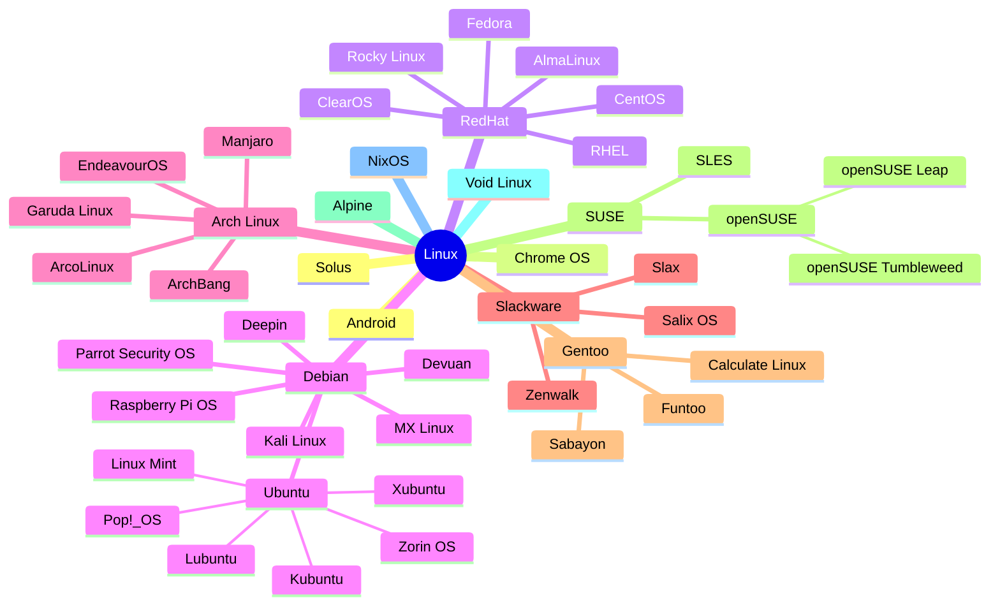

import LinksSection from '@site/src/components/LinksSection';
import SizedImage from '@site/src/components/SizedImage';

# Linux

## Introduction
Linux est un **noyau de système d'exploitation**, c'est à dire une base logicielle qui permet à un ordinateur de fonctionner. Il est utilisé dans de nombreux systèmes d'exploitation, appelés **distributions**, qui ajoutent des logiciels et des outils pour en faire un système complet.

### Principes et philosophie

#### Open-source
`Linux is a success precisely because it's not a business. Users know that it was written by the community, not for money. The fact that they can use it for free is much more important than the actual cost of the software.` — *Linus Torvalds*

Linux est un système d'exploitation **open-source**, ce qui signifie que son code source est accessible à tous. Cela permet à chacun de l'étudier, de le modifier et de le redistribuer librement.\
C'est ce qui permet à Linux d'être utilisé dans de nombreux systèmes différents, et de s'adapter à de nombreux usages. C'est aussi ce qui a permis à Linux de devenir un système d'exploitation très populaire, notamment dans le monde des serveurs et des supercalculateurs. Entre autre grâce à sa **stabilité**, sa **sécurité** et sa **fiabilité** (bien que cela dépende de la distribution).

Super nouvelle : Linux est **gratuit** ! (Il ne coûte pas d'argent, mais du temps et de l'énergie pour l'installer et le configurer).

#### Communauté
`The thing with open source is that it tends to come from the ground up. It doesn’t come from a large, bureaucratic hierarchy. It comes from normal people doing work and communicating.` — *Linus Torvalds*

Linux est développé par une **communauté de développeurs** du monde entier, qui contribuent à son développement et à son amélioration. Cela permet à Linux d'évoluer rapidement, et de s'adapter aux besoins des utilisateurs.\
Cela permet surout de corriger rapidement les bugs et les failles de sécurité, et de proposer de nouvelles fonctionnalités. C'est aussi ce qui apporte cette polyvalence à Linux.

#### Choix
`Linux is about giving users and developers the power to have their own choices. It’s not about some kind of One True Path dictated by the needs of the vendor.` — *Linus Torvalds*

Linux est conçu pour offrir aux utilisateurs une grande **liberté de choix**. Il existe de nombreuses distributions Linux, qui proposent chacune une approche différente du système d'exploitation. Cela permet à chacun de trouver la distribution qui correspond le mieux à ses besoins et à ses préférences.

Par principe, tout est personnalisable et configurable, ce qui permet de créer un système d'exploitation sur-mesure, adapté à ses besoins. C'est ce qui fait la force de Linux et le bonheur des développeurs, mais aussi sa complexité.

### Systèmes d'exploitation basés sur Linux

Le noyau linux est utilisé dans tous ces systèmes d'exploitation. Chacun de ces systèmes est une distribution Linux, qui ajoute des logiciels et des outils pour en faire un système complet.

#### Pourquoi autant de distributions ?
Parce que chacune a ses spécificités, ses avantages et ses inconvénients, et qu'il y en a pour tous les goûts.\
Certaines distributions sont conçues pour être **faciles à utiliser** et **grand public**, d'autres sont conçues pour être **légères** et **rapides**, d'autres encore sont conçues pour être **sécurisées** et **stables**.\
Il y a aussi des distributions spécialisées pour des usages spécifiques, comme le **hacking éthique** (Kali Linux), le **développement** (Ubuntu), ou l'**éducation** (Raspberry Pi OS).\
Certaines sont prévues pour tester les dernières technologies (Arch Linux), d'autres pour être utilisées en entreprise (Red Hat, SUSE), faire tourner des serveurs (Debian, CentOS), ou des supercalculateurs (RHEL).\
Certaines sont **rolling release**, c'est à dire qu'elles sont mises à jour en continu, d'autres sont **stables**, c'est à dire qu'elles proposent des versions figées dans le temps.

## Utilisation des distributions Linux
Une fois la distribution Linux installée, vous pouvez l'utiliser comme n'importe quel autre système d'exploitation. Vous pouvez lancer des applications, naviguer sur internet, lire des fichiers, programmer...

### Terminal
<SizedImage src="https://bashlogo.com/img/symbol/svg/full_colored_dark.svg" alt="Logo Bash" type="icon"/>
Le **terminal** est un outil essentiel pour utiliser Linux. C'est une **interface en ligne de commande** (CLI) qui permet de communiquer avec l'ordinateur en tapant des commandes.\
Il peut littéralement tout faire, c'est beaucoup plus puissant et rapide (quand on sait s'en servir) qu'une interface graphique. Que ce soit pour **installer des logiciels**, **gérer des fichiers**, **automatiser des tâches**, **surveiller le système**, **débugger**, **programmer**, **écrire des scripts**, **configurer le système**, **mettre en place des raccourcis**,...

Il existe de nombreux **terminaux** pour Linux, le plus connu étant `bash`, mais il en existe d'autres comme `zsh`, `fish`, `ksh`...

### Package manager
Les distributions Linux utilisent un **gestionnaire de paquets** pour installer, mettre à jour et supprimer des logiciels.\
Il en existe énormément, les plus connus sont `dnf` (RHEL et ses enfants), `apt` (Debian et ses enfants), `pacman` (Arch Linux et ses enfants), `apk` (Alpine), `flatpak` et `snap` (universels en théorie).

Il s'agit souvent d'outils CLI, mais il existe des interfaces graphiques pour les utiliser.
Ils permettent de **gérer les dépendances** des logiciels, de les **mettre à jour** automatiquement, de les installer en un clic.\
Par principe, ils sont plus **sécurisés** que les installateurs Windows, car ils installent des logiciels provenant de **dépôts de confiance**. Et surtout ils sont **simples** à utiliser.

### Interface graphique
Certaines distributions Linux (Alpine, Arch Linux,...) sont conçues pour être utilisées uniquement en **ligne de commande**, ce qui veut dire qu'elles n'ont que le terminal pour interface.\
D'autres sont conçues pour être utilisées en **interface graphique** (GUI). Il existe de nombreuses interfaces graphiques pour Linux, les plus connues étant [Gnome](https://www.gnome.org/) et [KDE](https://kde.org/).

### Logiciels
Pas de panique, Linux propose une alternative à **quasiment tous les logiciels Windows**, en plus elle tourne souvent mieux et est plus légère.\
Les seuls logiciels qui ne sont pas disponibles sur Linux sont les logiciels **propriétaires** (Adobe, Microsoft, AutoDesk,...), mais il existe souvent des alternatives libres qui font le travail. Et les jeux vidéos ne sont pas toujours compatibles, mais ça s'améliore de jour en jour (tant que Gabe sera là).

- **Navigateur web** : [Firefox](https://www.mozilla.org/fr/firefox/new/), [Chromium](https://www.chromium.org/), [Brave](https://brave.com/fr/), [Vivaldi](https://vivaldi.com/fr/), [Opera](https://www.opera.com/fr)
- **Suite bureautique** : [LibreOffice](https://fr.libreoffice.org/), [OnlyOffice](https://www.onlyoffice.com/fr/)
- **Messagerie** : [Thunderbird](https://www.thunderbird.net/fr/), [Evolution](https://wiki.gnome.org/Apps/Evolution)
- **Musique** : [Rhythmbox](https://wiki.gnome.org/Apps/Rhythmbox), [Clementine](https://www.clementine-player.org/fr/)
- **Video** : [VLC](https://www.videolan.org/vlc/index.fr.html), [MPV](https://mpv.io/)
- **Edition image** : [GIMP](https://www.gimp.org/), [Krita](https://krita.org/fr/), [Inkscape](https://inkscape.org/fr/)
- **Montage video** : [Kdenlive](https://kdenlive.org/fr/), [Shotcut](https://shotcut.org/), [OpenShot](https://www.openshot.org/fr/)
- **Code** : [Visual Studio Code](https://code.visualstudio.com/), [Atom](https://atom.io/), [Sublime Text](https://www.sublimetext.com/), [Vim](https://www.vim.org/), [Emacs](https://www.gnu.org/software/emacs/)
- **Antivirus** : [ClamAV](https://www.clamav.net/), [Sophos](https://www.sophos.com/fr-fr.aspx), [Bitdefender](https://www.bitdefender.fr/), [ESET](https://www.eset.com/fr/)

### Sécurité
Linux est **sécurisé** par nature, car il est basé sur des principes de sécurité solides. Il est:
- **moins vulnérable aux virus** et aux malwares que Windows, car il est **moins ciblé** par les attaquants.
- **plus stable** et **plus fiable** que Windows, car les gens qui le développent sont des passionnés qui veulent un système qui marche bien.
- **plus respectueux de la vie privée** que Windows, car il ne collecte pas de données personnelles.

Cependant il n'est pas invulnérable, il faut quand même **faire attention** à ce qu'on fait sur internet, à ce qu'on installe, à ce qu'on télécharge, à ce qu'on partage. Il faut bien sûr faire les mises à jour de sécurité et éventuellement installer un antivirus (ClamAV, Sophos, Bitdefender, ESET).

## Lexique
- **Noyau** : Partie centrale du système d'exploitation, qui gère les ressources matérielles de l'ordinateur.
- **Distribution Linux** : Système d'exploitation complet basé sur le noyau Linux.
- **Open-source** : Logiciel dont le code source est accessible à tous.
- **Propriétaire** : Logiciel dont le code source n'est pas accessible.
- **CLI** : Command Line Interface, interface en ligne de commande, qui permet de communiquer avec l'ordinateur en tapant des commandes.
- **GUI** : Graphical User Interface, interface graphique, qui permet de communiquer avec l'ordinateur en utilisant des éléments graphiques.
- **Gestionnaire de paquets** : Outil qui permet d'installer, mettre à jour et supprimer des logiciels.
- **Dépôt** : Serveur qui contient des logiciels et des mises à jour pour une distribution Linux.
- **Rolling release** : Distribution Linux qui est mise à jour en continu, sans avoir besoin de réinstaller le système.
- **Stable** : Distribution Linux qui propose des versions figées dans le temps, qui sont mises à jour régulièrement.
