import LinksSection from '@site/src/components/LinksSection';
import SizedImage from '@site/src/components/SizedImage';

# PostgreSQL

<LinksSection
    title="Liens utiles"
    links={[
      {displayName: "PostgreSQL", url: "https://www.postgresql.org/"},
      ]}
/>

<SizedImage src="https://wiki.postgresql.org/images/a/a4/PostgreSQL_logo.3colors.svg" alt="PostgreSQL Logo" type="bigIcon"/>

## Introduction
PostgreSQL est un système de gestion de base de données relationnelles (DBMS) open source né en 1986. Il est reconnu pour sa robustesse, sa fiabilité, ses performances et sa conformité aux standards SQL.\
Il a été créé pour être un remplaçant open source de Ingres, un autre système de gestion de base de données relationnelles. Il est aujourd'hui l'un des systèmes de gestion de base de données les plus populaires au monde, utilisé par de nombreuses entreprises et organisations pour stocker, gérer et analyser leurs données.

### Avantages
Toutes ces propriétés en font un choix idéal pour les applications nécessitant une grande disponibilité, une grande fiabilité et une grande performance.
- Il permet notamment **plusieurs connexions concurrentes** et des **transactions ACID** (Atomicité, Cohérence, Isolation, Durabilité). Cela offre un énorme avantage par rapport à une base de données SQLite par exemple.
- Il est également **très extensible**, avec la possibilité d'ajouter des extensions et des types de données personnalisés.
- Le système de **permissions** et de **sécurité** est très complet, permettant de définir des rôles, des privilèges et des politiques de sécurité très finement.
- Il offre des possibilités de **scaling** **horizontal** et **vertical**, de **réplication**, de **clustering** et de **partitionnement**, ce qui en fait un choix populaire pour les applications web et les systèmes d'information.
- Il est **open source** et **gratuit**, ce qui en fait un choix économique pour les petites et moyennes entreprises.

### Inconvénients
- Il est **plus complexe** à installer car il nécessite de tourner en mode serveur.
- Il est **plus lourd** que SQLite, ce qui peut être un inconvénient pour les applications embarquées.
- Il peut-être **moins rapide** que SQLite pour des opérations de lecture simple, car il nécessite de passer par le réseau (qui peut être lente) pour accéder à la base de données.

### License
C'est un logiciel libre distribué sous **licence PostgreSQL**, une licence open source similaire à la licence MIT. Cela veut dire que vous pouvez l'utiliser, le modifier et le distribuer librement.

## Fonctionnement
PostgreSQL fonctionne en mode **client-serveur**. Cela signifie que le serveur PostgreSQL tourne en permanence sur une machine, et que les clients se connectent à ce serveur pour effectuer des opérations sur la base de données.

### Fonctionnalités principales
- **SQL**: PostgreSQL supporte le langage SQL standard, ainsi que des extensions comme les fonctions stockées, les triggers, les vues, les procédures stockées, les transactions, les contraintes, les index,...
- **Data Types**: PostgreSQL supporte de nombreux types de données standards
    - **Primitifs**: Integer, Numeric, String, Boolean
    - **Structurés**: Date/Time, Array, Range / MultiRange, UUID
    - **Documents**: JSON, JSONB, XML, Hstore
    - **Géométriques**: Point, Segment, Cercle, Polygone
    - **User Defined Data Types**: PostgreSQL permet de définir des types de données personnalisés, notamment des structures de données complexes, des fonctions, des opérateurs,...
- **Intégrité des données**: PostgreSQL supporte les contraintes de clé primaire, de clé étrangère, d'unicité, de vérification, de non-nullité, de contrôle de référence, de contrôle de domaine,...
- **Concurrence & Performance**: PostgreSQL permet de paralleliser les requêtes, de gérer les index, de gérer les statistiques, de gérer les caches, de gérer les verrous, de gérer les transactions,...
- **Robustesse & Disaster Recovery**: PostgreSQL supporte les sauvegardes, les restaurations, les points de contrôle, les journaux de transactions, les réplications, les sauvegardes incrémentales, les sauvegardes différentielles,... Il offre aussi une fonctionnalité de WAL (Write Ahead Logging) pour garantir la cohérence des données lors d'un crash ou d'un fort nombre de requêtes.
- **Sécurité**: PostgreSQL supporte les rôles, les privilèges, les politiques de sécurité, les audits, les logs, les connexions sécurisées, les connexions chiffrées, les connexions authentifiées,...
- **Extensibilité**: PostgreSQL permet d'ajouter des extensions pour ajouter des fonctionnalités supplémentaires (PostGIS pour les données géographiques, pgcrypto pour le chiffrement, hstore pour le stockage de données semi-structurées,...).

### Architecture
PostgreSQL est un système de gestion de base de données relationnelles (RDBMS) qui stocke les données dans des tables, qui sont des collections de lignes et de colonnes. Chaque table est définie par un schéma, qui définit les colonnes, les types de données, les contraintes, les index, les triggers, les vues, les procédures stockées,...

```mermaid
architecture-beta
    service users(clarity:users-solid)[Users]

    group postgresql(cloud)[Cluster PostgreSQL]
    group database(database)[Database 1] in postgresql
    service table1(disk)[Table 1] in database
    service table2(disk)[Table 2] in database
    service schema[Schema 1] in database
    service index[Index 1] in database

    group database2(database)[Database 2] in postgresql

    users:B --> T:table1
```



## Commandes
Voici quelques commandes utiles pour interagir avec PostgreSQL.
- `psql`: Ouvre un terminal interactif pour interagir avec PostgreSQL.
    - le shell psql supporte toutes les commandes SQL standards, il faut bien penser à terminer les requêtes par un `;`.
    - `\l`: Liste les bases de données.
    - `\c <database>`: Se connecte à une base de données.
    - `\dt`: Liste les tables de la base de données.
    - `\d <table>`: Affiche la structure d'une table.
    - `\q`: Quitte le terminal psql.
- **Création & Suppression**
    - `createdb`: Crée une base de données PostgreSQL.
    - `dropdb`: Supprime une base de données PostgreSQL.
    - `createuser`: Crée un utilisateur PostgreSQL.
    - `dropuser`: Supprime un utilisateur PostgreSQL.
- **Backup & Restore**:
    - `pg_dump`: Sauvegarde une base de données PostgreSQL.
    - `pg_restore`: Restaure une base de données PostgreSQL.
- **Gestion de l'instance**:
    - `pg_ctl`: Contrôle le serveur PostgreSQL.
    - `pg_isready`: Vérifie si le serveur PostgreSQL est prêt.
    - `pg_config`: Affiche la configuration de l'instance PostgreSQL.

## Utilisation sur aioli
Le cluster postgres est accessible sur la machine aioli par tous les utilisateurs via le socket unix `/var/run/postgresql/.s.PGSQL.5432`. Chaque utilisateur peut se connecter à la base de données qui porte le même nom que son compte, sans mot de passe.\
Chaque utilisateur ne peut pas créer de nouvelles bases de données ou d'utilisateurs. Il ne peut que se connecter à sa propre base de données et faire ce qu'il veut dedans. En revanche, il n'a accès qu'en lecture seule aux bases de données des autres utilisateurs.

### Connexion via terminal
Vous pouvez utiliser la commande `psql` pour interagir avec votre base de données. La commande vous envoie directement dans le shell psql de votre base de données.\
Vous pouvez alors effectuer toutes les opérations SQL standards: créer des tables, insérer des données, mettre à jour des données, supprimer des données, supprimer des tables, créer des index, créer des vues, créer des procédures stockées,...

### Connexion via programme

#### Node.js

##### Installation des dépendances
Pour se connecter à une base de données PostgreSQL depuis un programme Node.js, vous pouvez utiliser le module `pg` qui est un client PostgreSQL pour Node.js.\
Additionnellement, vous pouvez utiliser `sequelize` qui est un ORM (Object-Relational Mapping) pour Node.js qui supporte PostgreSQL. Cela permet d'intéragir avec la base de données de manière plus abstraite, en utilisant des modèles et des requêtes SQL générées automatiquement.\
Enfin, nous utiliserons dotenv qui nous permettra de charger les variables environnement système ou de les définir dans un fichier `.env`.

L'installation de ces dépendances se fait via npm: `npm install --save pg sequelize dotenv`.

##### Connexion à la base de données
Pour se connecter à la base de données, vous devez créer une instance de `Sequelize` en lui passant les informations de connexion à la base de données.

```javascript
import { Sequelize } from 'sequelize';
import dotenv from 'dotenv';

// Importe les variables d'environnement depuis le fichier .env (la variable USER est déjà définie dans l'environnement de base d'aioli, pas besoin de la définir dans le fichier .env)
dotenv.config();

// Définition des variables de connexion
const DBUSER = process.env.USER;
const DBNAME = process.env.USER;

// Création de l'instance Sequelize
const sequelize = new Sequelize(DBNAME, DBUSER, null, {
  dialect: 'postgres',
  host: '/var/run/postgresql',
  port: 5432,
  logging: false,
});

// Connexion à la base de données
(async () => {
  try {
    await sequelize.authenticate();
    console.log('Connection has been established successfully.');
  } catch (error) {
    console.error('Unable to connect to the database:', error);
  }
})();

// Exporte l'instance sequelize pour l'utiliser dans d'autres fichiers
export default sequelize;
```

Avec cette configuration, vous pouvez maintenant interagir avec votre base de données PostgreSQL depuis votre programme Node.js en appelant les méthodes de l'instance `sequelize`.
