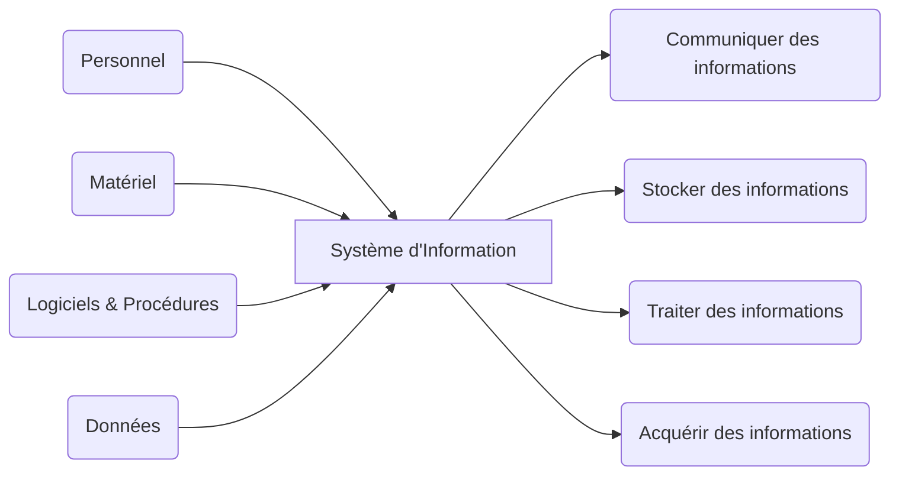
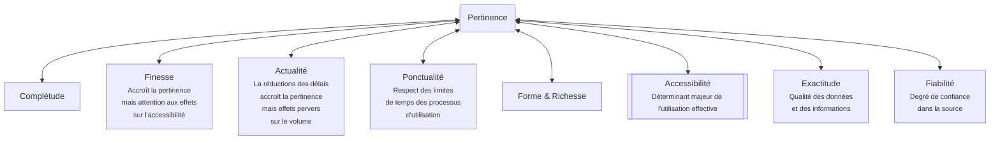
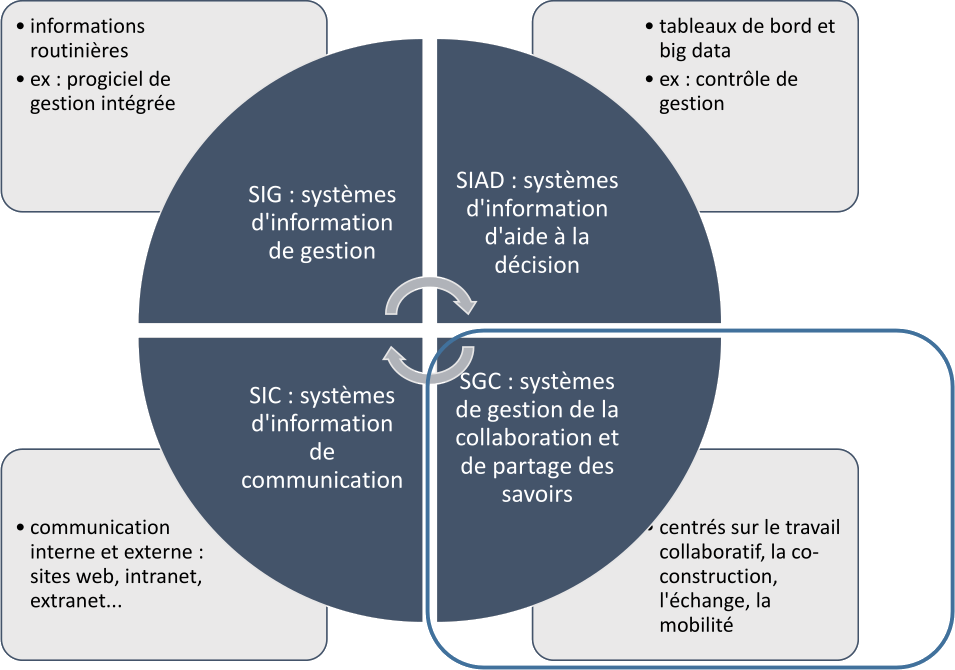
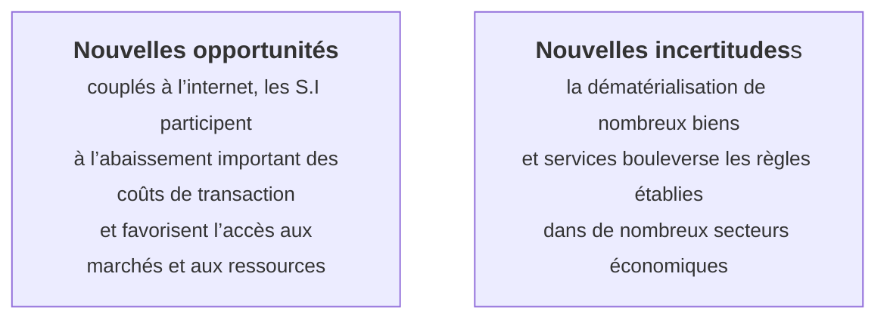

# Introduction au Management des Systèmes d'Information

*Laetitia Piet*\
[Diaporama](./documents/MSI_INTRO.pdf)

## Définitions

### Définition fonctionnelle

**<u>Schema de principe d'un SI:</u>**

Un système d’information est un ensemble organisé de ressources permettant d’acquérir, de traiter, de stocker
et de diffuser des informations dans et entre des organisations. Il est finalisé pour répondre à des objectifs.

**Niveaux de définition:**
| Niveau | Caractéristiques | Exemples |
| --- | --- | --- |
| Individuel | Utilsié par un individu à son poste de travail. N'implique pas qu'il a été implementé ni conçu par l'individu | Tableur Excel |
| Collectif | Plusieurs individus utilisent le même système d'information (une fonction, un service, un groupe) | Système de gestion des commandes |
| Organisationnel | Concerne et est accessible à l'ensemble de l'organisation | Système de messagerie électronique globale |
| Inter-organisationnel | Des organisations identiques s'entendent pour échanger et traiter par des voies automatiques, des informations d'intérêt commun | EDI (Echange de données informatisées) |

### Définition analytique

Un système d’information est un système d’acteurs sociaux qui mémorisent et transforment des représentations via des technologies de l’information
et des modes opératoires.\
*(d’après R.Reix et F. Rowe, 2002)*

Il existe 3 dimensions dans un SI:
1. Dimension informationnelle
2. Dimension technologique
3. Dimension organisationnelle

#### Dimension informationnelle

«Tout système d’information concerne un individu, pourvu d’un profil psychologique donné, confronté à un problème décisionnel précis, dans un contexte organisationnel déterminé. Il y a nécessité d’éléments de décision perçus au travers d’un mode de représentation propre au décideur. » *R.O. Mason, J.-L. Mitroff (1975), Management Science, vol.19 n°6, p.475.*

##### Relation entre données, informations et connaissances

<u>Schema simplifié:</u>

<u>Schema complet:</u>

L'information est une donnée interprétée par un individu ou un système. Elle est le résultat d'un traitement de données. Elle est utile pour la prise de décision.

##### Critères d'évaluation d'un SI

Il faut rester vigilant, un système d'information générant une quantité massive de données à faible coût risque de produire des informations inutiles et de saturer les utilisateurs.

### Dimension technologique
Un SI est un système qui utilise des technologies de l'information au sein d'une architecture (réseaux, serveurs, ordinateurs, logiciels...)

La technologie est à la fois une ressource et une contrainte pour l’exécution des tâches par les utilisateurs\
La technologie « en usage » est le résultat d’un double processus de construction (réalisé par les acteurs décideurs, concepteurs et utilisateurs)
- un processus au départ planifié
- puis un processus émergent ; ce résultat est partiellement indéterminé.
Les caractéristiques de la technologie, ainsi que les conditions de sa mise en place dans un contexte, ont un effet sur le processus d’appropriation

### Dimension organisationnelle

Un SI est un système qui supporte les processus de travail et la structure d’une organisation. Il y a 2 perspectives selon lesquelles on peut observer un SI:
- Le fonctionnement de l'organisation, le déroulement des processus de travail, à l'intérieur et aux frontières de l'organisation
- La structure de l'organisation, qui concerne les caractéristiques stables de toute l'organisation\
Un SI est à la fois un élément clé, essentiel au fonctionnement ainsi qu'à la structure de l'organisation.

#### Perspective des processus
Un processus est un ensemble d’activités et de tâches corrélées et synchronisées qui :
- A un objectif clair et précis rattaché, directement ou indirectement, au métier et aux activités de l ’entreprise
- Consomme des ressources et produit des résultats

**<u>Schema de principe d'un processus:</u>**

**<u>Catégories de processus:</u>**

#### Perspective de la structure
La construction de tout SI implique des choix déterminants quant à la conception de l’organisation :
- Choix relatifs au partage d’informations entre les acteurs
  - Répartition du pouvoir décisionnel et des responsabilités (degré de décentralisation)
  - Division du travail (degré de spécialisation)
- Choix relatifs au contenu des représentations et aux technologies de communication
  - Pertinence des informations pour quoi ? Pour qui ?
  - Moyens de coordination
- Choix relatifs au degré de formalisation et d’automatisation des processus de travail
  - Niveau de contrôle et d’autonomie des acteurs
  - Degré de standardisation / flexibilité

#### Modèles de l'utilisateur modèle

L'organisation effectue des choix qui déterminent le fonctionnement du SI et la capacité qu'aura ses utilisateurs à s'approprier le SI.
Elle peut choisir un modèle coercitif ou habilitant. Dans le premier cas, l'utilisateur modèle est passif, il ne peut rien faire d'autre qu'utiliser le SI, dans le second cas, il est actif et peut participer à l'évolution du SI.

##### Modèle coercitif
| **Caractéristiques des formalisations coercitives** | **Vision de l'utilisateur modèle** |
| --- | --- |
| **Impossibilité de réparer** | Ne doit pas intervenir par lui même lorsque la formalisation s'avère inutilisable, endommagée, ou mal adaptée aux circonstances |
| **Rigidité** | Ne doit pas pouvoir modifier l'outil par lui même |
| **Opacité Interne** | Ne doit pas comprendre le fonctionnement interne de l'outil, doit seulement suivre les indications données |
| **Opacité Globale** | Ne doit pas comprendre le fonctionnement du système dans lequel l'outil s'insère et opère |
| **Non participation au design** | Ne doit pas être associé au design de l'outil |
| **Non participation à l'implémentation** | Ne doit pas être associé à l'implémentation de l'outil |

##### Modèle habilitant
| **Caractéristiques des formalisations habilitantes** | **Vision de l'utilisateur modèle** |
| --- | --- |
| **Réparation** | Peut intervenir pour réparer l'outil, le modifier, l'adapter aux circonstances |
| **Flexibilité** | Peut ignorer, remettre en cause, modifier l'outil pour l'adapter à ses besoins |
| **Transparence interne** | Peut comprendre le fonctionnement interne de l'outil pour l'aider à le modifier |
| **Transparence globale** | Peut comprendre le fonctionnement du système dans lequel l'outil s'insère et opère |
| **Participation au design** | Capable de participer au design de l'outil car est source d'information utile |
| **Participation à l'implémentation** | Capable de participer à l'implémentation de l'outil car est source d'information utile |

### Classification des SI

## Enjeux
Via leur SI, les entreprises s’insèrent plus intensivement dans une mondialisation agitée

### Des évolutions majeures et des défis constants

#### Technologiques
- **Big Data et analyse de données massives**
- **Cloud computing**
- **Mobilité**
- **Intelligence artificielle**
- **XaaS (Everything as a Service)**

#### Organisationnels
- **Horizontalisation des organisations**
- **Collaboration**
- **Externalisation des activités**
- **Réactivité et agilité**
- **Nouvelles pratiques managériales**

## Management des SI

« Les SI ne doivent pas être simplement considérés comme une ressource de support, mais comme une ressource stratégique capable de donner un avantage concurrentiel durable à l’entreprise qui saura les utiliser. » (*Porter, 1985*)

### Enjeux du management des SI
- Interne
  - **Alignement stratégique**
  - **Création de valeur**
  - **Gestion des risques**
  - **Gestion des ressources**
  - **Gestion de la performance**
  - **Gestion des processus**
- Externe
  - **Conquête de nouveaux marchés**
  - **Amélioration de la relation client**
  - **Fidélisation des clients**
  - **Innovation**

### Usages des SI
- Automatisation des tâches
- Aide à la décision
- Communication
- Gestion des connaissances
- Collaboration
- Innovation
