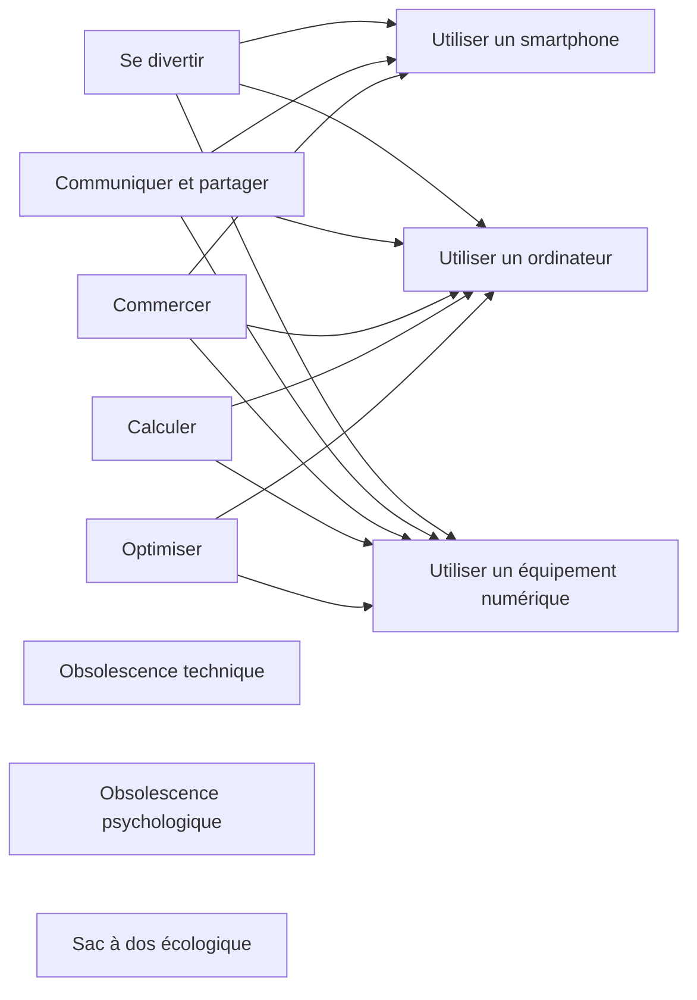

# Sobriété Numérique

*Nicolas Vallée*, consultant en numérique chez Wavestone

## Définition

## Fresque du Numérique

**Mesure de l'emprunte carbone**: La mesure d'empreinte environnementale du SI permet de mesurer le poids de l'activité numérique, généralement sur 1 an.\
L'emprunte carbone se mesure en kgCO2e/an.

## Numérique Responsable

**Volet environnemental d'une stratégie RSE**:\
Evaluer le point de départ, identifier les actions de réduction et se piloter pour atteindre les objectifs de réduction

### Grands chantiers pour monter en maturité sur le numérique responsable

- **Gouvernance & mesure de l'empreinte environnementale**
  - Organisation & gouvernance numérique responsable
  - Budget
  - Sponsoring du top management
  - Indicateurs & mesure de l'empreinte environnementale
  - Communication
  - Partenariat & écosystème
- **Conception responsable des projets**
  - Gestion de projet & priorisation
  - Etudes de marché & bonnes pratiques
  - Architecture
  - Gestion des données
- **Environnement de travail**
  - Postes de travail
  - Smartphones, tablettes & téléphones de bureau
  - Equipements audio/vidéo
  - Imprimantes
- **Culture**
  - Culture & sensibilisation
  - Recrutement
  - Compétences et formations
- **Approvisionnements & Fin de vie**
  - Achats d'équipements et de services
  - Gestion de la fin de vie des équipements
- **Infrastructure**
  - Datacenters & salles de serveurs
  - Réseau
  - Hébergement cloud & services
