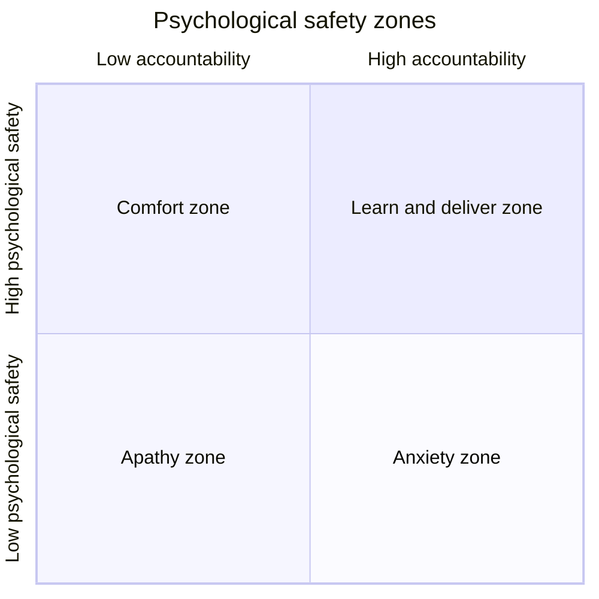
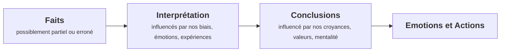
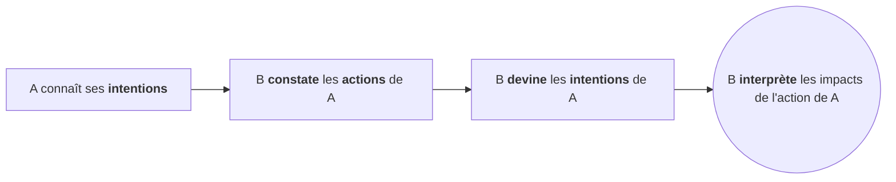

import LinksSection from '@site/src/components/LinksSection';

# High Performance Team

*Driving Business Results and Human values*

<LinksSection
    title="Ressources"
    links={[
      {displayName: "Slides Cours High Performance Team", url: "/do-it/documents/gestion_modelisation/hpt.pdf"},
    ]}
/>

## Introduction
*You cannot mandate productivity.\
You must provide the tools (and environment) to let people become their best.* - Steve Jobs

Lors de nos interactions avec des personnes, des équipes, des proches, on **ne contrôle pas** les résultats. On ne peut pas forcer quelqu'un à être productif, à être créatif, à être innovant. On ne peut pas forcer quelqu'un à être heureux.

### Définition
Une équipe hautement performante est un group de personnes qui travaillent en synergie au travers de différents rôles. Ils travaillent ensemble avec vers un objectif commun. Ils délivrent de manière consistantes des résultats exceptionnels.

### Pourquoi ?
Une équipe hautement performante est capable de délivrer des **résultats 5 fois supérieurs** à la moyenne. C'est une équipe qui **décuple les performances individuelles** en les faisant collaborer en **synergie**. Elle **attire** et **retient** les meilleurs talents. Elle crée une grande satisfaction des membres de l'équipe, un bien-être et un amusement.

## Les 5 dysfonctionnements d'une équipe
|||
|---|---|
|**Insouciance du résultat**|La poursuite des objectifs individuels et personnels diminue le succès de l'équipe|
|**Manque de responsabilité**|Le besoin d'éviter l'inconfort personnel empêche l'équipe de tenir les autres membres responsables|
|**Manque d'engagement**|Le manque de clarté ou d'engagement bloque les prises de décisions engageantes de l'équipe|
|**Peur du conflit**|Le désir de préserver l'harmonie artificielle empêche  l'équipe de s'engager dans des débats productifs|
|**Absence de confiance**|La peur de montrer sa faiblesse, de se montrer vulnérable empêche de créer un climat de confiance|

### Confiance
|Absence de confiance|Confiance|
|---|---|
|**Dissimulation** des faiblesses et des erreurs entre collègues|**Admettre** ses faiblesses et erreurs|
|**Peur** de demander de l'aide ou de donner des feedbacks|**Demande** de l'aide|
|**Pas d'engagement** au delà de ses responsabilités|**Concentration** du temps et de l'énergie sur les problèmes importants, pas la politique|
|**Mauvais jugement / Conclusions hâtives** sur les intentions / capacités des autres|**Bénéfice du doute** avant de tirer des conclusions|
|**Ressentiment** et **rancune**|**Heureux** de travailler en groupe|

La confiance se construit difficilement, mais se perd très rapidement. Elle est la base de toute relation humaine.\
Elle peut être renforcée par des **actions** et des **comportements**.
- **Partager** ses faiblesses, ses erreurs, ses manques de connaissances afin de se montrer **vulnérable** et de montrer qu'on a besoin des autres.
- **Respect** des membres de l'équipe, de leur temps, de leur travail, de leur opinion.
- **Intégrité** entre ses actions et ses paroles.
- **Etat d'esprit** positif et centré sur l'équipe.
- **Sécurité psychologique** pour que les membres de l'équipe se sentent en sécurité pour exprimer leurs idées, leurs opinions, leurs émotions.

#### Sécurité Psychologique

### Conflit
|Peur du conflit|Conflit|
|---|---|
|Réunions ennuyeuses, sans plus-value|Réunions énergiques, intéressantes|
|Environnements d'attaques à revers politiques / personnels|Minimisation de la politique|
|Evite les sujets controversiaux critique au succès de l'équipe|Discute des sujets critiques|
|Pas d'exploitation des opinions et des idées de l'équipe|Récolter et utiliser les opinions et les idées de l'équipe|
||Résout les problèmes rapidement|

#### Conflit Productif
Un *conflit productif* est un conflit qui se déroule sous la forme d'une **conversation structuré**. Il faut s'assurer qu'il y a bien un **dialogue**, de l'**écoute active**, de la **négotiation**. Cela permet d'établir une **conversation productive**.\
Il en découle de **meilleures solutions** et une **confiance renforcée**.

#### Ecoute productive
Quelques règles d'or pour assurer une écoute active et utile:
- **Ecouter** sans chercher à interrompre
- **Ne pas se battre** pour son tour de parole
- Chercher à **comprendre d'abord**, puis à être compris. On influence plus en écoutant qu'en parlant
- Avoir l'**intention d'apprendre** (être ouvert au changement) et de construire ensemble, pas de convaincre
- LIE: *Listen*, *Inquire*, *Explore*
- Montrer que l'on écoute, avec son corps, ses expressions et des résumés de ce qu'on a compris

##### Déroulé idéal
Dans l'idéal, une conversation productive suit ce déroulement:
1. Trouver un objectif commun
2. S'accorder sur le fait que chacun détient une part de la solution et de la vérité. Les deux contribuent à la solution
3. Expliquer que l'on souhaite d'abord comprendre l'autre, puis être compris
4. Repasser les solutions qui prennent en compte les deux points de vue
5. S'accorder et s'engager
6. Penser ensemble au futur

##### Eviter la défensive
Il faut éviter de pousser l'autre à se défendre. Il faut éviter de lui donner l'impression qu'il est attaqué. Quelques bonnes pratiques pour éviter cela:
- Utiliser la première personne le plus possible afin de décrire l'impact sur soi
    - ✅ Quand je t'ai vu faire X, j'ai pensé Y, j'ai pensé Z
    - ❌ Tu as fait X, tu voulais me faire Y, tu m'as fait me sentir Z
- Utiliser **je pense** au lieu d'énoncer ses interprétations comme des faits
- Ne pas catégoriser ou juger les actions ou la personne
    - ❌ Tu as été méchant avec moi. Pourquoi tu m'as fait ça ?
    - ❌ Tu n'as pas agi correctement quand...
- Ne pas utiliser **jamais** ou **toujours**
    - ❌ Tu fais toujours/jamais ça !

#### Négociation
Une négociation est un processus de **communication** entre deux ou plusieurs parties qui cherchent à **trouver un accord**.\
Il est important de **comprendre** les besoins et les intérêts de l'autre partie. Il faut **chercher des solutions** qui satisfont les deux parties.\
Il est important de **distinguer** les **positions** des **intérêts**. Les positions sont les demandes, les intérêts sont les besoins derrière ces demandes.

##### Déroulé idéal
1. **Préparation**: Définir ses intérêts (les besoins), pas seulement ses positions (les demandes)
    - Définir ses variables d'ajustement (ce sur quoi on peut négocier)
    - Définir son/ses **B**est **A**lternative **T**o a **N**egotiated **A**greement
2. **Approfondir**: Comprendre les intérêts et les variables d'ajustement de l'autre partie
    - Poser des questions ouvertes
    - Ecouter activement
3. **Lister** les alternatives possibles (Gagnant-Gagnant, Gagnant-Perdant, Perdant-Perdant)
4. **Accord ?**
    - ✅ Engagement des deux parties
    - ❌ Retour au BATNA, ou montée en escalade

### Engagement
|Manque d'engagement|Engagement|
|---|---|
|L'équipe considère les livrables comme optionnels|Saisir les occasions professionnels avant les concurrents|
|Ambiguité sur les objectifs et les priorités|Crée de la clarté sur les objectifs et les priorités|
|Remise en question permanente des décisions|Avance sans hésitation|
|Favorise le doute et la méfiance|Permet de changer de direction sans hésitation / culpabilité|

Pour s'assurer de l'engagement personnel d'un équipier, il faut lui donner un **sentiment de responsabilité**. Il faut lui donner un **sentiment d'appartenance**. Il faut lui donner un **sentiment de reconnaissance**.\
Il est important de verbaliser:
- ✅ Je veux atteindre X. Je te demande de faire Y pour la date Z. Est-ce que tu es d'accord ?
- Réponses possibles:
    - ✅ Oui, je suis d'accord. Je vais le faire.
    - ✅ Non, je ne suis pas d'accord. Je ne peux pas le faire pour telle raison.
    - ✅ Ca dépend, j'ai besoin de plus d'informations / de ressources / de temps.
    - ✅ Ca dépend, j'ai besoin de reformuler la demande.
    - ❌ Oui, il faudrait faire Y !
    - ❌ Je vais faire de mon mieux
    - ❌ Faisons le tous ensemble

La réponse doit être **claire**, et surtout elle doit verbaliser l'**engagement**

### Responsabilité
|Manque de responsabilité|Responsabilité|
|---|---|
|Ressentiment entre les personnes avec des standards de performances différents|Etablit un respect mutuel et des standards de performances élevés|
|Favorise la médiocrité|Encourage les moins bons à s'améliorer|
|Rate les deadlines et les livrables clés|Identifie les problèmes rapidement en questionnant les approches des autres sans hésitation|
|Le leader devient policier|Pas de besoin de bureaucratie pour s'assurer que les choses sont faites|

Il faut s'attendre à ce que chacun des membres de l'équipe (y compris soi-même) respecte ses engagements de livrables.\
Il faut que les membres de l'équipe (pas uniquement le chef) demandent des comptes aux autres membres de l'équipe dans l'éventualité où ils ne respectent pas leurs engagements.\
Il faut être à même de s'excuser et de proposer des solutions pour réparer les erreurs.

**Responsable** ne veut pas dire **Coupable**. Cela veut dire que l'on est capable de répondre de ses actes, de ses décisions, de ses erreurs.

### Insouciance du résultat
|Insouciance du résultat|Résultat|
|---|---|
|Stagnation / Absence de croissance|Partage les succès et les échecs|
|Décrochage des employés motivés par les résultats|Attrait et rétention des meilleurs talents|
|Encourage les équipiers à se concentrer sur leurs propres objectifs|Minimisation des comportements individualistes|
|Beaucoup de distractions|Pas de distractions|

*To optimize a system, you need to sub-optimize the subsystems*

Pour motiver l'équipe et la rendre souciante des résultats, il faut:
- **Définir des objectifs clairs** et **mesurables**
- **Célébrer les succès** et **apprendre des échecs**
- **Partager les succès** et les échecs
- **Créer un sentiment d'appartenance** et de **fierté** pour l'équipe

## Modèles

### Modèles de leadership

#### Contrôle unilatéral
Dans un modèle de leadership par le contrôle unilatéral, le **leader prend toutes les décisions**, contrôle les actions des membres de l'équipe, et ne laisse pas de place à l'initiative des membres de l'équipe.\
Il se base sur la croyance qu'**il est rationnel**, que **les autres ne le sont pas**(autant que lui) et qu'ils sont **motivés par la peur**.

Il applique des stratégies et des objectifs qu'il décide **unilatéralement**. Son but est de dominer les autres, que ce soit en manipulant l'information ou en applicant la stratégie du bâton et de la carotte. Il ne montre aucune émotion ni vulnérabilité.

#### Apprentissage mutuel
Dans un modèle de leadership par apprentissage mutuel, le leader consulte les membres pour constituer une **vision commune**.\
Il est **conscient de ses limites** et il **compte sur les autres** pour les compenser. Tout le monde est motivé par le fait d'apprendre et de contribuer.

Les objectifs et les stratégies sont définis **ensemble**. Le but est de faire **gagner toute l'équipe**. Il y a une bonne **transparence des informations**. Il crée un **sentiment d'engagement et de responsabilité**. Il montre ses émotions.

### Chemin de Mentalité
*Certainty is lethal to two of our most redeeming and humane qualities, imagination and empathy* - Being Wrong: Adventures in the Margin of Error by Kathryn Schulz

Il est essentiel de garder en tête que son chemin n'est pas le seul chemin possible.

Il faut prendre garde à ne pas deviner les intentions des autres

#### Je-Sais-Tout
Le **Je-Sais-Tout** est une personne qui a une **mentalité fixe**. Elle pense que ses capacités et ses talents sont **innés** et **immuables**. Elle pense qu'elle est **meilleure** que les autres. Elle a **peur de l'échec** et de montrer ses faiblesses.\
Elle **évite** les challenges, les critiques, les feedbacks. Elle **dévalorise** les autres.

Pour motiver cette personne, il faut faire preuve de patience et de persévérance. Il faut lui montrer qu'il est écouté. C'est son besoin le plus important. Ensuite on peut entrer dans le conflit productif.

#### Apprenant
L'**Apprenant** est une personne qui a une **mentalité de croissance**. Elle pense que ses capacités et ses talents sont **développables**. Elle pense qu'elle peut **apprendre** et **grandir**. Elle est **curieuse** et **ouverte**. Elle **accepte** l'échec et les critiques.

#### Victime
La **Victime** est une personne qui se place dans une position de **faiblesse**. Elle pense que les événements sont **hors de son contrôle**. Elle pense qu'elle est **injustement traitée**. Elle **se plaint** et **blâme** les autres, les circonstances...

- Qu'est-ce qu'il vient de m'arriver ?
- Qui m'a fait ça ?
- Qu'est ce qu'il aurait dû faire à la place ?
- Que doit-il faire pour réparer ?

#### Player
Le **Player** est une personne qui se place dans une position de **responsabilité**. Elle pense que les événements sont **sous son contrôle**. Elle pense qu'elle peut **agir** pour changer les choses. Elle **cherche des solutions** et **prend des décisions**.
