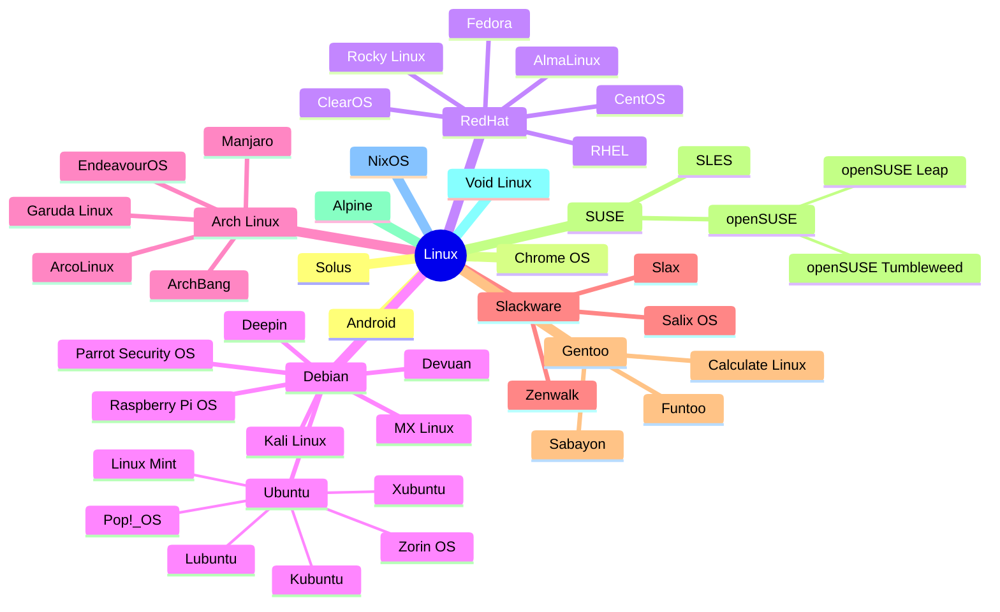

import LinksSection from '@site/src/components/LinksSection';
import SizedImage from '@site/src/components/SizedImage';

# Linux

<LinksSection
    title="Liens utiles"
    links={[
      {displayName: "Cours Bases Linux", url: "https://francoisbrucker.github.io/cours_informatique/cours/syst%C3%A8me-et-r%C3%A9seau/linux/bases-linux/"},
      ]}
/>

## Introduction
Linux est un **noyau de système d'exploitation**, c'est à dire une base logicielle qui permet à un ordinateur de fonctionner. Il est utilisé dans de nombreux systèmes d'exploitation, appelés **distributions**, qui ajoutent des logiciels et des outils pour en faire un système complet.

### Principes et philosophie

#### Open-source
`Linux is a success precisely because it's not a business. Users know that it was written by the community, not for money. The fact that they can use it for free is much more important than the actual cost of the software.` — *Linus Torvalds*

Linux est un système d'exploitation **open-source**, ce qui signifie que son code source est accessible à tous. Cela permet à chacun de l'étudier, de le modifier et de le redistribuer librement.\
C'est ce qui permet à Linux d'être utilisé dans de nombreux systèmes différents, et de s'adapter à de nombreux usages. C'est aussi ce qui a permis à Linux de devenir un système d'exploitation très populaire, notamment dans le monde des serveurs et des supercalculateurs. Entre autre grâce à sa **stabilité**, sa **sécurité** et sa **fiabilité** (bien que cela dépende de la distribution).

Super nouvelle : Linux est **gratuit** ! (Il ne coûte pas d'argent, mais du temps et de l'énergie pour l'installer et le configurer).

#### Communauté
`The thing with open source is that it tends to come from the ground up. It doesn’t come from a large, bureaucratic hierarchy. It comes from normal people doing work and communicating.` — *Linus Torvalds*

Linux est développé par une **communauté de développeurs** du monde entier, qui contribuent à son développement et à son amélioration. Cela permet à Linux d'évoluer rapidement, et de s'adapter aux besoins des utilisateurs.\
Cela permet surout de corriger rapidement les bugs et les failles de sécurité, et de proposer de nouvelles fonctionnalités. C'est aussi ce qui apporte cette polyvalence à Linux.

#### Choix
`Linux is about giving users and developers the power to have their own choices. It’s not about some kind of One True Path dictated by the needs of the vendor.` — *Linus Torvalds*

Linux est conçu pour offrir aux utilisateurs une grande **liberté de choix**. Il existe de nombreuses distributions Linux, qui proposent chacune une approche différente du système d'exploitation. Cela permet à chacun de trouver la distribution qui correspond le mieux à ses besoins et à ses préférences.

Par principe, tout est personnalisable et configurable, ce qui permet de créer un système d'exploitation sur-mesure, adapté à ses besoins. C'est ce qui fait la force de Linux et le bonheur des développeurs, mais aussi sa complexité.

### Systèmes d'exploitation basés sur Linux


Le noyau linux est utilisé dans tous ces systèmes d'exploitation. Chacun de ces systèmes est une distribution Linux, qui ajoute des logiciels et des outils pour en faire un système complet.

#### Pourquoi autant de distributions ?
Parce que chacune a ses spécificités, ses avantages et ses inconvénients, et qu'il y en a pour tous les goûts.\
Certaines distributions sont conçues pour être **faciles à utiliser** et **grand public**, d'autres sont conçues pour être **légères** et **rapides**, d'autres encore sont conçues pour être **sécurisées** et **stables**.\
Il y a aussi des distributions spécialisées pour des usages spécifiques, comme le **hacking éthique** (Kali Linux), le **développement** (Ubuntu), ou l'**éducation** (Raspberry Pi OS).\
Certaines sont prévues pour tester les dernières technologies (Arch Linux), d'autres pour être utilisées en entreprise (Red Hat, SUSE), faire tourner des serveurs (Debian, CentOS), ou des supercalculateurs (RHEL).\
Certaines sont **rolling release**, c'est à dire qu'elles sont mises à jour en continu, d'autres sont **stables**, c'est à dire qu'elles proposent des versions figées dans le temps.

## Utilisation des distributions Linux
Une fois la distribution Linux installée, vous pouvez l'utiliser comme n'importe quel autre système d'exploitation. Vous pouvez lancer des applications, naviguer sur internet, lire des fichiers, programmer...

### Terminal
<SizedImage src="https://bashlogo.com/img/symbol/svg/full_colored_dark.svg" alt="Logo Bash" type="icon"/>
Le **terminal** est un outil essentiel pour utiliser Linux. C'est une **interface en ligne de commande** (CLI) qui permet de communiquer avec l'ordinateur en tapant des commandes.\
Il peut littéralement tout faire, c'est beaucoup plus puissant et rapide (quand on sait s'en servir) qu'une interface graphique. Que ce soit pour **installer des logiciels**, **gérer des fichiers**, **automatiser des tâches**, **surveiller le système**, **débugger**, **programmer**, **écrire des scripts**, **configurer le système**, **mettre en place des raccourcis**,...

Il existe de nombreux **terminaux** pour Linux, le plus connu étant `bash`, mais il en existe d'autres comme `zsh`, `fish`, `ksh`...

### Package manager
Les distributions Linux utilisent un **gestionnaire de paquets** pour installer, mettre à jour et supprimer des logiciels.\
Il en existe énormément, les plus connus sont `dnf` (RHEL et ses enfants), `apt` (Debian et ses enfants), `pacman` (Arch Linux et ses enfants), `apk` (Alpine), `flatpak` et `snap` (universels en théorie).

Il s'agit souvent d'outils CLI, mais il existe des interfaces graphiques pour les utiliser.
Ils permettent de **gérer les dépendances** des logiciels, de les **mettre à jour** automatiquement, de les installer en un clic.\
Par principe, ils sont plus **sécurisés** que les installateurs Windows, car ils installent des logiciels provenant de **dépôts de confiance**. Et surtout ils sont **simples** à utiliser.

### Interface graphique
Certaines distributions Linux (Alpine, Arch Linux,...) sont conçues pour être utilisées uniquement en **ligne de commande**, ce qui veut dire qu'elles n'ont que le terminal pour interface.\
D'autres sont conçues pour être utilisées en **interface graphique** (GUI). Il existe de nombreuses interfaces graphiques pour Linux, les plus connues étant [Gnome](https://www.gnome.org/) et [KDE](https://kde.org/).

### Logiciels
Pas de panique, Linux propose une alternative à **quasiment tous les logiciels Windows**, en plus elle tourne souvent mieux et est plus légère.\
Les seuls logiciels qui ne sont pas disponibles sur Linux sont les logiciels **propriétaires** (Adobe, Microsoft, AutoDesk,...), mais il existe souvent des alternatives libres qui font le travail. Et les jeux vidéos ne sont pas toujours compatibles, mais ça s'améliore de jour en jour (tant que Gabe sera là).

- **Navigateur web** : [Firefox](https://www.mozilla.org/fr/firefox/new/), [Chromium](https://www.chromium.org/), [Brave](https://brave.com/fr/), [Vivaldi](https://vivaldi.com/fr/), [Opera](https://www.opera.com/fr)
- **Suite bureautique** : [LibreOffice](https://fr.libreoffice.org/), [OnlyOffice](https://www.onlyoffice.com/fr/)
- **Messagerie** : [Thunderbird](https://www.thunderbird.net/fr/), [Evolution](https://wiki.gnome.org/Apps/Evolution)
- **Musique** : [Rhythmbox](https://wiki.gnome.org/Apps/Rhythmbox), [Clementine](https://www.clementine-player.org/fr/)
- **Video** : [VLC](https://www.videolan.org/vlc/index.fr.html), [MPV](https://mpv.io/)
- **Edition image** : [GIMP](https://www.gimp.org/), [Krita](https://krita.org/fr/), [Inkscape](https://inkscape.org/fr/)
- **Montage video** : [Kdenlive](https://kdenlive.org/fr/), [Shotcut](https://shotcut.org/), [OpenShot](https://www.openshot.org/fr/)
- **Code** : [Visual Studio Code](https://code.visualstudio.com/), [Atom](https://atom.io/), [Sublime Text](https://www.sublimetext.com/), [Vim](https://www.vim.org/), [Emacs](https://www.gnu.org/software/emacs/)
- **Antivirus** : [ClamAV](https://www.clamav.net/), [Sophos](https://www.sophos.com/fr-fr.aspx), [Bitdefender](https://www.bitdefender.fr/), [ESET](https://www.eset.com/fr/)

### Sécurité
Linux est **sécurisé** par nature, car il est basé sur des principes de sécurité solides. Il est:
- **moins vulnérable aux virus** et aux malwares que Windows, car il est **moins ciblé** par les attaquants.
- **plus stable** et **plus fiable** que Windows, car les gens qui le développent sont des passionnés qui veulent un système qui marche bien.
- **plus respectueux de la vie privée** que Windows, car il ne collecte pas de données personnelles.

Cependant il n'est pas invulnérable, il faut quand même **faire attention** à ce qu'on fait sur internet, à ce qu'on installe, à ce qu'on télécharge, à ce qu'on partage. Il faut bien sûr faire les mises à jour de sécurité et éventuellement installer un antivirus (ClamAV, Sophos, Bitdefender, ESET).

## Architecture fichiers
Linux a pour principe de tout considérer comme un fichier, ce qui simplifie la gestion des ressources. Ainsi, toutes les interactions avec le système se font via des fichiers, que ce soit pour les périphériques, les processus, les réseaux, les utilisateurs, les logs, les configurations,...

### Types de fichiers
Il existe 4 catégories de fichiers sous Linux:
- **Fichiers ordinaires** : Contiennent des données textuelles, binaires, ou autre.
- **Répertoires** : Contiennent des fichiers et d'autres répertoires. C'est ce que vous appelez **A TORT** des dossiers.
- **Pseudo-fichiers** : Représentent des ressources matérielles ou logicielles, comme les périphériques, les processus, les sockets, les partitions, les montages, les systèmes de fichiers, les informations système,...
- **Liens** : Permettent de créer des raccourcis vers des fichiers ou des répertoires.

### Arborescence
Sur linux, les fichiers sont organisés dans une **arborescence** qui commence à la racine (UNIQUE) du système de fichiers (`/`). Voici une vue simplifiée de l'arborescence Linux:
```
/ : racine du système de fichiers
├── bin : programmes executables essentiels (binaires)
├── boot : fichiers nécessaires au démarrage du système
├── dev : fichiers de périphériques (devices)
├── etc : fichiers de configuration
├── home : répertoires personnels des utilisateurs
├── lib : bibliothèques partagées
├── media : points de montage pour les supports amovibles
├── mnt : points de montage temporaires pour les supports amovibles
├── opt : logiciels installés manuellement
├── proc : informations sur les processus
├── root : répertoire personnel de l'administrateur
├── run : fichiers temporaires
├── sbin : programmes executables essentiels (binaires système)
├── srv : données des services
├── sys : informations sur le système
├── tmp : fichiers temporaires
├── usr : programmes et fichiers partagés
└── var : fichiers variables (logs, spools, etc.)
```

### Permissions
Linux est un système **multi-utilisateurs** et **multi-tâches**, ce qui signifie que plusieurs utilisateurs peuvent utiliser le système en même temps, et que plusieurs tâches peuvent s'exécuter simultanément.\
Pour garantir la **sécurité** et la **confidentialité** des données, Linux utilise un système de **permissions** qui définit les **droits d'accès** aux fichiers et aux répertoires.

Chaque fichier et répertoire possède des **permissions** qui définissent les actions que chaque utilisateur peut effectuer sur ce fichier ou ce répertoire. Il existe trois types de permissions:
- **Lecture** (r) : Permet de lire le contenu du fichier ou du répertoire.
- **Écriture** (w) : Permet de modifier le contenu du fichier ou du répertoire.
- **Exécution** (x) : Permet d'exécuter le fichier ou d'accéder au contenu du répertoire.

Pour définir les permissions d'un fichier, il faut déterminer les **droits d'accès** pour les trois catégories d'utilisateurs:
- **Propriétaire** : L'utilisateur qui possède le fichier ou le répertoire.
- **Groupe** : Un ensemble d'utilisateurs qui partagent des droits d'accès communs.
- **Autres** : Tous les autres utilisateurs du système.

### Commandes
Voici quelques commandes utiles pour gérer les fichiers et les répertoires sous Linux. Toutes ces commandes s'utilisent dans le terminal. Elles peuvent être suivies d'options pour personnaliser leur comportement. ATTENTION, il n'y a pas de corbeille, les fichiers supprimés le sont définitivement. Il n'y a pas non plus de raccourcis clavier pour annuler une commande.
- **Navigation**
    - **`ls`** : Affiche la liste des fichiers et des répertoires.
    - **`cd`** : Change de répertoire.
    - **`pwd`** : Affiche le chemin du répertoire courant.
- **Gestion**
    - **`touch`** : Crée un nouveau fichier.
    - **`mkdir`** : Crée un nouveau répertoire.
    - **`cp`** : Copie un fichier ou un répertoire.
    - **`mv`** : Déplace un fichier ou un répertoire.
    - **`rmdir`** : Supprime un répertoire vide.
    - **`rm`** : Supprime un fichier ou un répertoire.
- **Permissions**
    - **`chmod`** : Modifie les permissions d'un fichier ou d'un répertoire.
    - **`chown`** : Modifie le propriétaire et le groupe d'un fichier ou d'un répertoire.
    - **`chgrp`** : Modifie le groupe d'un fichier ou d'un répertoire.
- **Recherche**
    - **`find`** : Recherche des fichiers et des répertoires.
    - **`grep`** : Recherche des motifs dans les fichiers.
- **Affichage**
    - **`cat`** : Affiche le contenu d'un fichier.
    - **`more`** : Affiche le contenu d'un fichier page par page.
    - **`less`** : Affiche le contenu d'un fichier page par page avec plus de fonctionnalités.
    - **`head`** : Affiche les premières lignes d'un fichier.
    - **`tail`** : Affiche les dernières lignes d'un fichier.
- **Compression**
    - **`tar`** : Archive des fichiers, peut aussi les compresser ou les décompresser.
    - **`zip`** : Compresse des fichiers.
    - **`unzip`** : Décompresse des fichiers.
- **Autres**
    - **`ln`** : Crée un lien symbolique ou un lien dur.
    - **`du`** : Affiche l'espace disque utilisé par les fichiers et les répertoires.
    - **`df`** : Affiche l'espace disque disponible sur les systèmes de fichiers.
    - **`mount`** : Montre les systèmes de fichiers montés.
    - **`umount`** : Démonte un système de fichiers.

## Processus
Un **processus** est un programme en cours d'exécution sur un système d'exploitation. Chaque processus possède un identifiant unique appelé **PID** (Process IDentifier) qui permet de le distinguer des autres processus.\
Sur Linux, il est possible d'avoir une multitude de processus en cours d'exécution, chacun effectuant une tâche spécifique.\
Les processus peuvent être **interactifs** (lancés depuis un terminal) ou **démon** (lancés en arrière-plan).\
Vous pouvez consulter les processus dans `/proc`, chaque processus a un répertoire correspondant à son PID.

### Notions de base

#### Hierarchie
Les processus sous Linux sont organisés en **arborescence**. Chaque processus a un **processus parent** qui l'a créé, et peut avoir des **processus enfants** qu'il a créés.\
Le premier processus créé par le noyau est appelé **init**, et il est le parent de tous les autres processus. Il est responsable du démarrage et de l'arrêt du système. Il est souvent remplacé par **systemd** sur les distributions récentes.

Lorsqu'un processus se termine, il envoie un **signal** à son processus parent pour l'informer de sa terminaison. Le processus parent peut alors récupérer le **code de sortie** du processus enfant pour savoir s'il s'est terminé correctement.

Lorsqu'un processus parent se termine, ses processus enfants meurent également. Cependant, il est possible de **détacher** un processus de son processus parent pour qu'il continue à s'exécuter de manière autonome. Cela n'est pas automatique.

#### Priorité
Chaque processus sous Linux possède une **priorité** qui détermine son ordre d'exécution par rapport aux autres processus.\
La priorité d'un processus est définie par son **niceness**, qui peut prendre des valeurs entre -20 et 19. Plus la valeur est basse, plus la priorité est élevée.\
Un processus avec une priorité élevée sera exécuté avant les autres processus, tandis qu'un processus avec une priorité basse sera exécuté après les autres processus. La priorité par défaut est 0. *Il est possible de modifier la priorité d'un processus en cours d'exécution*.

#### État
Un processus sous Linux peut se trouver dans différents **états** en fonction de son activité:
- **En cours d'exécution** : Le processus est en train de s'exécuter.
- **En attente** : Le processus attend un événement ou une ressource.
- **Arrêté** : Le processus est arrêté ou en pause.
- **Zombie** : Le processus s'est terminé mais son processus parent ne l'a pas encore récupéré. Il occupe toujours une entrée dans la table des processus.

#### Foreground et Background
Un processus peut s'exécuter en **foreground** ou en **background**.\
Lorsqu'un processus s'exécute en **foreground**, il occupe le terminal et attend que l'utilisateur interagisse avec lui. Il bloque l'entrée du terminal et empêche l'exécution d'autres commandes tant qu'il n'est pas terminé.\
Lorsqu'un processus s'exécute en **background**, il ne bloque pas le terminal mais continue à s'exécuter en arrière-plan. Il communique toujours avec la sortie standard du terminal, mais n'attend pas d'entrée de l'utilisateur.

Pour exécuter en background un processus supposé s'exécuter en foreground, il suffit de rajouter `&` à la fin de la commande.\
Pour passer un processus en background, il suffit de taper `Ctrl+Z` pour le mettre en pause, puis `bg` pour le passer en background.

### Commandes
Voici quelques commandes utiles pour gérer les processus sous Linux. Toutes ces commandes s'utilisent dans le terminal. Elles peuvent être suivies d'options pour personnaliser leur comportement.
- **Affichage**
    - **`ps`** : Affiche les processus en cours
    - **`pstree`** : Affiche les processus en cours sous forme d'arborescence
    - **`top`** : Affiche les processus en cours et leur consommation de ressources
    - **`htop`** : Affiche les processus en cours et leur consommation de ressources de manière plus détaillée
- **Gestion**
    - **`nohup`** : Rattache un processus à un autre terminal
    - **`kill`** : Arrête un processus
    - **`killall`** : Arrête tous les processus portant un nom donné
    - **`pkill`** : Arrête les processus correspondant à un motif donné
    - **`pgrep`** : Affiche les PID des processus correspondant à un motif donné
    - **`nice`** : Modifie la priorité d'un processus
    - **`renice`** : Modifie la priorité d'un processus en cours
- **Autres**
    - **`bg`** : Passe un processus en arrière-plan
    - **`fg`** : Passe un processus en premier plan
    - **`jobs`** : Affiche les processus en cours et leur état

## Lexique
- **Noyau** : Partie centrale du système d'exploitation, qui gère les ressources matérielles de l'ordinateur.
- **Distribution Linux** : Système d'exploitation complet basé sur le noyau Linux.
- **Open-source** : Logiciel dont le code source est accessible à tous.
- **Propriétaire** : Logiciel dont le code source n'est pas accessible.
- **CLI** : Command Line Interface, interface en ligne de commande, qui permet de communiquer avec l'ordinateur en tapant des commandes.
- **GUI** : Graphical User Interface, interface graphique, qui permet de communiquer avec l'ordinateur en utilisant des éléments graphiques.
- **Gestionnaire de paquets** : Outil qui permet d'installer, mettre à jour et supprimer des logiciels.
- **Dépôt** : Serveur qui contient des logiciels et des mises à jour pour une distribution Linux.
- **Rolling release** : Distribution Linux qui est mise à jour en continu, sans avoir besoin de réinstaller le système.
- **Stable** : Distribution Linux qui propose des versions figées dans le temps, qui sont mises à jour régulièrement.
