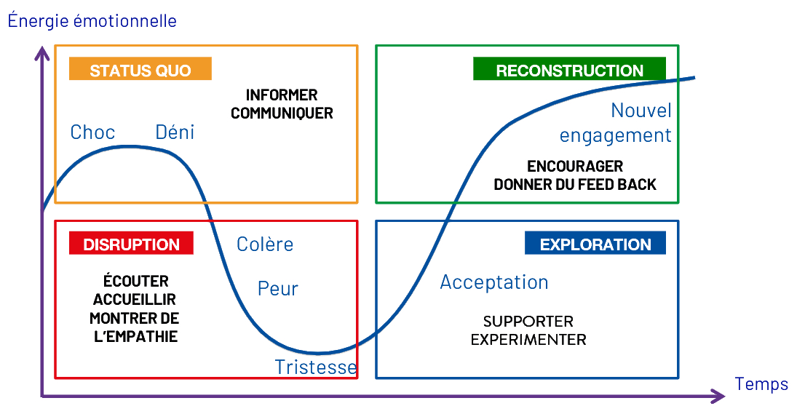

import LinksSection from '@site/src/components/LinksSection';

# Conduite du changement

<LinksSection
    title="Ressources"
    links={[
      {displayName: "Slides Pilotage du changement", url: "/do-it/documents/tc/pilotage_du_changement.pdf"},
      {displayName: "Slides Gestion des transitions", url: "/do-it/documents/tc/gestion_des_transitions.pdf"},
    ]}
/>

## Introduction

### Définitions

**Changement**: Un événement, une situation extérieur à nous : quelque chose s’arrête ou quelque chose commence\
**Transition**: Un processus de réorientation graduel et psychologique qui se produit à l’intérieur de nous\
Le changement appelle la transition, et inversement. Pour autant, l’alignement entre les deux n’est pas nécessairement au rdv

*"Les personnes responsables de la planification et de la mise en oeuvre du changement oublient souvent que, même si la première tâche de la conduite de changement consiste à comprendre la destionation et la façon d'y arriver, la première tâche de la gestion des transitions consiste à convaincre les personnes de quitter leur maison.\
Vous vous épargnerez beaucoup de désagrément si vous vous en souvenez."* - William Bridges

| Changement | Transition |
|------------|------------|
| Externe | Interne |
| Situationnel | Psychologique |
| Fondé sur un évènement | Fondée sur l'expérience |
| Défini par son objectif | Définie par son processus |
| Peut se produire vite | Prend du temps |
| Centré sur son lancement | Démarre par une fin |

**Résistance**: Un phénomène naturel qui se manifeste lorsqu'un individu ou un groupe s'oppose à un changement.\
**Engagement**: Un état d'esprit qui se manifeste lorsqu'un individu ou un groupe s'implique activement dans un changement.

### La résistance
*La résistance est naturelle, c'est un mélange complexe de*
- Changement (la circonstance extérieure à nous)
- Transition (le processus de réorientation à l'intérieur de nous)
- Résonance (la signification personnelle en écho du passé)

*On dit que les gens résistent au changement, le plus souvent ils résistent en fait à la transition*
- Perte de leur identité et de leur univers
- Désorientation de la zone neutre
- Risque d'échec dans le nouveau départ

### Résistance ou engagement ?
*Dans quelle circonstances seriez-vous enclin(e) à résister au changement ?*
- Pas de clarté, pas de sens, pas de discours convaincant
- Mal communiqué, expliqué ou planifié
- Contre mes intérêts ou les intérêts de mon équipe / l'organisation
- Pas de confiance, un management pas à la hauteur, un manque d'éthique
- Changement imposé, non négocié, non concerté

*Dans quelle circonstances seriez-vous prêt(e) à vous engager vraiment dans la mise en oeuvre d'un changement ?*
- Besoin & but clair
- Vision, Stratégie & Plan d'action clair
- Bénéfice pour moi & pour l'organisation
- Participation & implication dans le processus de changement
- Confiance dans les acteurs du changement

## Management des transitions

### Courbe de deuil: Elisabeth Kübler-Ross

#### Etapes du deuil
La courbe de deuil est un modèle qui décrit les différentes étapes par lesquelles une personne passe lorsqu'elle est confrontée à une perte ou un changement majeur. Les étapes dans le modèle adapté au contexte du changement organisationnel sont les suivantes:

1. **Annonce** - La nouvelle est inattendue et brutale
2. **Déni** - Refus de croire à la réalité de la situation
3. **Colère** - Réaction de frustration et de colère
4. **Marchandage (Peur)** - Tentative de négocier pour éviter la situation
5. **Dépression (Tristesse)** - Réaction de tristesse et de désespoir
6. **Acceptation** - Acceptation de la réalité de la situation
7. **Nouvel engagement** - Engagement dans la nouvelle situation

#### Manager selon les étapes du deuil
Selon l'étape du deuil dans laquelle se trouve la personne, le manager doit adopter une attitude et un comportement adapté:
1. **Choc & Déni** - Dans un premier temps, le manager doit **Informer** et **Communiquer** la nouvelle
2. **Colère & Peur & Tristesse** - Dans la phase descendante, vive et intense en émotions, le manager doit **Ecouter**, **Accompagner** et se montrer **Empathique**
3. **Acceptation** - Dans la phase ascendante, le manager doit **Supporter** et **Experimenter** avec la personne
4. **Nouvel engagement** - Enfin, le manager doit **Encourager** et **Donner du feedback** concernant les nouvelles actions

#### Vitesse de transition
Il faut rester vigilant car il y a des différences de rythme et de réaction entre les individus.
Notamment entre la direction, les managers et les collaborateurs, qui n'apprennent généralement pas en même temps la nouvelle. Ils ne sont pas non plus affectés de la même manière par le changement. Et ils n'ont pas les mêmes valeurs, objectifs, motivations, intérêts, vision.\
Souvent, la direction (qui décide souvent du changement) est en avance sur les managers qui sont en avance sur les collaborateurs.

### Phases de la transition
On distingue 3 phases dans le processus de transition:

- Fin
    - Quand nous nous désengageons des vieilles manières de faire et que l’on quitte qui nous étions dans cette situation (par exemple faire le deuil de son ancien métier lors d'un changement de job ou de reconversion professionnelle)
- Zone Neutre
    - Quand nous nous trouvons dans un état troublant d’entre-deux, où nous ne sommes plus qui et où nous étions, mais nous ne sommes pas encore qui et où nous allons être
- Nouveau Départ
    - Quand nous nous familiarisons avec et que nous acceptons (sans nécessairement l’apprécier)  la réalité nouvelle que le changement apporte. Nous commençons à nous identifier à nouveau avec la situation où nous sommes

Déterminer où se situe une personne dans le processus de transition est essentiel pour adapter son accompagnement. Il est important de ne pas brûler les étapes et de respecter le rythme de chacun.

Il est essentiel de ne pas garder les individus dans la zone de fin trop longtemps, car cela risque de les plonger dans un état de dépression, de démotivation et de perte de sens. Il est donc important de **les aider** à passer rapidement dans la zone neutre pour les aider à **rebondir** et à **se projeter** dans le nouveau départ.\
Il faut aussi **accompagner** les individus dans la zone neutre pour les aider à **se réorienter**, à **se repositionner** et à **se réinventer**. Il est important de les aider à **se projeter** dans le nouveau départ pour les aider à **se réengager** et à **se réinvestir**.\
Concernant la zone de nouveau départ, il est important de les aider à **s’approprier** la nouvelle situation, à **s’y adapter** et à **s’y intégrer**. Il ne faut **pas les laisser seuls** face à la nouveauté, ni les considérer acquis, mais **les accompagner** dans leur découverte et leur exploration.

### Carte des acteurs
La **carte des acteurs** est un outil essentiel pour faire face aux antagonismes et aux résistances lors d'un changement.\
Il s'agit de cartographier les acteurs en fonction de leur pouvoir et de leur intérêt pour le changement et de définir une stratégie pour chacun d'eux.

La carte des acteurs se représente sous la forme d'une matrice à deux dimensions:
- **Antagonisme**: Sur l'axe horizontal, il s'agit de la position d'un point de vue personnel de l'acteur par rapport au changement. Il souligne le degré de soutien ou d'opposition en lien avec ses valeurs, ses croyances, ses intérêts, ses motivations, ses objectifs, sa vision, ses compétences
    1. **Minimaliste**: Plutôt favorable, il restreint ses relations avec les acteurs du projet au strict minimum
    2. **Intéressé**: Il s’intéresse à ce que recherchent, disent et font les  acteurs. Il consulte, discute et travaille mais cherche à se positionner au-dessus du strict nécessaire
    3. **Coopératif**: Il prend l’initiative de développer des synergies, cherche des consensus, fait des suggestions, travaille et utilise ses propres leviers pour soutenir les acteurs du projet. S’ils le suivent, la synergie pourra s’accroître au sein de leur relation
    4. **Dévoué**: Il s’identifie aux acteurs du projet pour les aider à atteindre l’objectif commun, même si les acteurs du projet sont réticents et quelles que soient les conséquences pour lui !
- **Synergie**: Sur l'axe vertical, il s'agit de la position d'un point de vue professionnel et de l'équipe de l'acteur par rapport au changement. Il souligne le degré de soutien ou d'opposition en lien avec ses relations, le groupe, l'organisation, le projet, le management
    1. **Indifférent**: Il hésite, car il est sincèrement indécis. Il se ralliera à un point de vue opposé de manière passive, et à une personne plus décidée que lui
    2. **Non Intéressé**: Il utilise certains leviers et cherche par la négociation à obtenir le meilleur compromis possible pour lui. Il peut céder en fin de journée
    3. **Réticent**: Il utilise des leviers plus importants pour imposer sa propre solution. S’il n’y parvient pas, il cèdera de façon désagréable  au seul pouvoir supérieur et seulement pour un certain temps.
    4. **Hostile**: Il utilise absolument tous les moyens pour imposer sa propre solution. S’il ne parvient pas à le faire, il interrompra toute relation !

Il est primordial de garder en tête que le positionnement d'un acteur sur la carte des acteurs n'est pas figé et peut évoluer en fonction de l'avancement du projet et des interactions avec les autres acteurs. Il est donc important de mettre à jour régulièrement la carte des acteurs pour s'assurer que la stratégie adoptée est toujours pertinente.

#### Les acteurs
- Passif: Fait le minimum
- Indécis: Prêt à s'impliquer... s'il obtient quelque chose en retour
- Hostile: Ne se rallie que sous la contrainte du pouvoir supérieur. Peut décider de stopper la confrontation
- Opposant: Gouverné par la satisfaction de son intérpet personnel
- Engagé: Soutient la cause
- Constructif: Soutient le projet et est susceptible de "positiver" la critique
- Déchiré: Ressent autant d'amour que de haine

#### La stratégie des alliés
Une fois que les acteurs sont identifiés, construisez une stratégie pour chaque fonction. **Passez 2/3 de votre temps avec vos Alliés**:\
**Louez leurs efforts**, **acceptez** les pour ce qu’ils sont, apportez leur votre **soutien**, **passez du temps** avec eux ... et en retour, soyez **exigeant** !\
**Entourez** les *Passifs* et les *Indécis*, **motivez** les en leur offrant un **projet commun** sur lequel travailler, acceptez les **compromis** sur les sujets de moindre importance.\
**Proposez / suggérez** (à tout moment) aux Passifs de se joindre à un projet, accroissant ainsi leur énergie.\
Utilisez vos Alliés pour convaincre, **ignorer ou exclure vos opposants**.\
Utilisez 1/3 de votre temps (au maximum) pour contenir les tentatives des Opposants et des Hostiles cherchant à rallier les Passifs de leur côté, en faisant des contre-propositions.\
Si nécessaire, **neutralisez les Opposants**

#### Actions à mener
Cette image illustre les actions à mener en fonction de la position de l'acteur sur la carte des acteurs.

## Management du changement
Nous allons traiter de deux approches pour piloter le changement:
- Top Down
- Bottom Up

### Top Down (Modèle de Kotter)
1. Etablir un sentiment d'urgence
2. Former une puissante coalition de pilotage
3. Créer une vision
4. Communiquer la vision
5. Donner aux autres les moyens d'agir sur la vision
6. Planifier et créer des gains à court terme
7. Consolider les améliorations et produire encore plus de changement
8. Institutionnaliser les nouvelles approches

#### Avantages
- Une décision et une mise en oeuvre rapides
- Un souffle de perspective, une vision à long terme
- Une stratégie claire
- Courage des changements réels et radicaux, allant au delà des intérêts des sous-unités
- Peut englober la transformation de systèmes / structures complexes
- Intérêts des actionnaires
- Un contrôle clair
- Légitimité de l'autorité / demande
- Crédibilité du projet
- Un pouvoir et une influence forts
- Accès aux ressources

#### Cas d'usage
- Très peu de temps / crise
- Décisions difficiles / des changements radicaux à prendre
- Nécessiteé d'impulser des changements structurels, complexes et à l'échelle mondiale
- Volonté de repositionner l'entreprise
- Résultat visé très clair
- Conflits au sein de l'organisation
- Confiance établie
- Histoire d'un succès
- Convient à la culture directive de l'entreprise
- Manque de capacités
- Avoir de l'argent pour faire appel à des spécialistes externes

### Bottom Up (Modèle de Beer)
1. Mobiliser l'engagement par un diagnostic commun des problèmes
2. Développer une vision commune de la manière d'organiser et de gérer pour réussir
3. Favoriser le consensus, la compétence, la cohésion
4. Diffuser les changements en encourageant, en soutenant et non en forçant
5. Institutionnaliser les changements par des politiques, des systèmes, des structures
6. Surveiller et ajuster en fonction des problèmes

#### Avantages
- Développement des personnes / autonomisation / responsabilité
- Leadership et compétences émergentes
- Opinions d'experts internes, créativité
- Motivation et engagement des personnes
- Sentiment de propriété / appartenance
- Reconnaissance / valorisation des personnes
- Mise en oeuvre plus facile, moins de résistance
- Elargissement de la coalition, soutien plus large & alliances internes
- Constituer une intention stratégique consensuelle
- Renforcement de la confiance, de la fierté et du respect mutuel
- Processus adaptatifs, consensus ad hoc
- Renforcement de la culture d'entreprise

#### Cas d'usage
- Temps disponible
- Changement axé sur le client
- Unités très autonomes évoluant dans des contextes très spécifiques
- Changements culturels et de mentalités
- Ouvert à diverses bonnes solutions, besoin d'explorer
- Consensus possible
- Nécessité de (re)construire la confiance
- Acceptation du changement nécessaire
- Convient à la culture participative de l'entreprise
- Des personnes qualifiées avec des capacités développées
- Besoin de former des leaders internes

**Dans la réalité**, l'opposition entre top down et bottom up est artificielle.\
Les processus de changement doivent (la plupart du temps) utiliser des boucles top down / bottom up. Les deux approches sont complémentaires.\
L'engagement de la direction générale est aussi essentiel au succès du changement que la participation des personnes à sa mise en oeuvre.\
Les alliances entre les cadres supérieurs et les autres membres de l'organisation nécessitent une confiance réciproque, un respect mutuel et de la fierté.\
Il n'y a pas d'ordre absolu à respecter.

### 10 Principes du change management
- Pour lancer le changement
    1. Etablir un sentiment d'urgence
    2. Former un comité de pilotage
    3. Créer une vision pour le projet de changement
    4. Mobiliser l'engeagement en impliquant largement dans le processus
- Tout au long du processus
    1. Favoriser le consensus, la compétence, la cohésion
    2. Communiquer et communiquer à nouveau
    3. Gérer les obstacles et les difficultés
    4. Diffuser les changements et encourageant, en soutenant et non forçant
    5. Planifier à court terme et célébrer les petites victoires
- Et surtout
    1. Recommencer !
